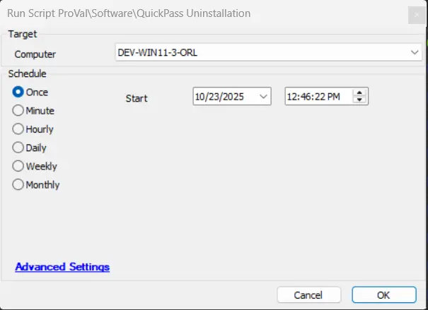

## Summary
This script can be used to silently remove the QuickPass Agent from Windows machines.

## Sample Rum

## Output
- Script Logs
- Ticketing

## Ticketing

Tickets will be generated only if the `TicketCreationCategory` value is greater than 0. Make sure to use the correct `TicketCreationCategory` to direct the tickets to the right board.

**Subject:** `QuickPass Uninstallation Failed for %ClientName%\%ComputerName% at %LocationName%`

**Ticket Body:** `Failed to uninstall QuickPass agent` .
 `Command Result: %shellresult%`