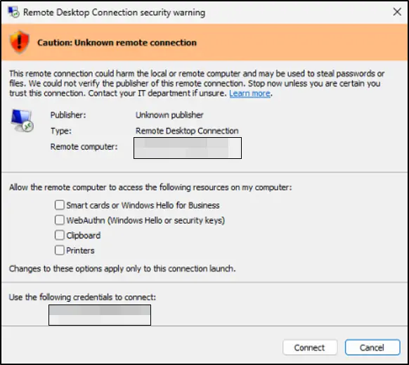
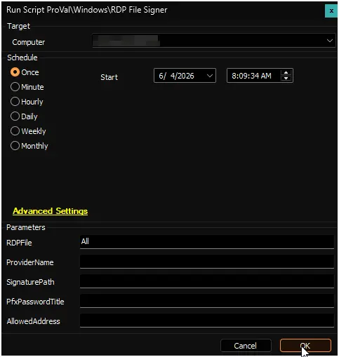
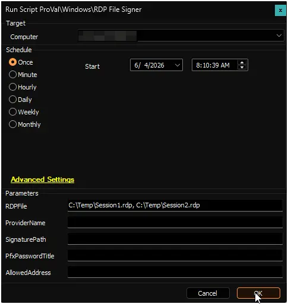
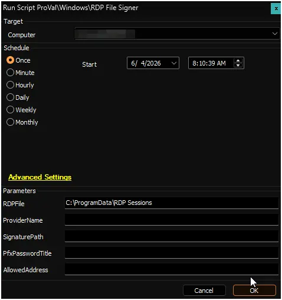
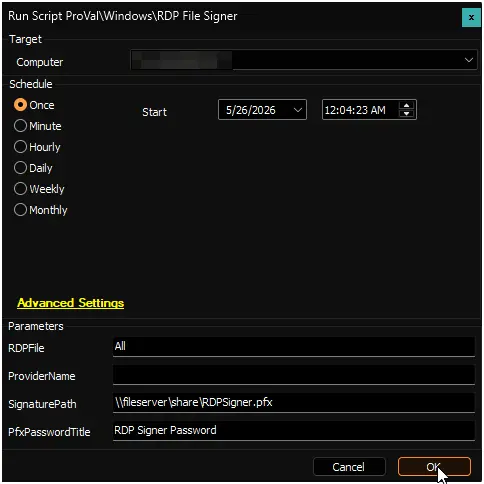
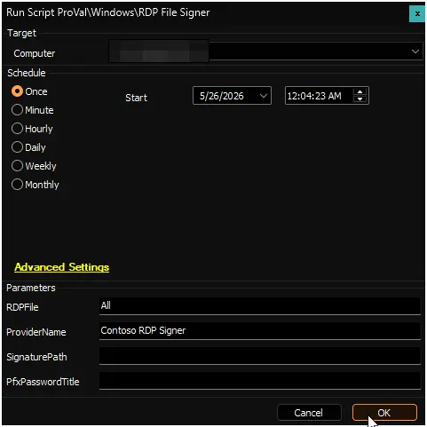

## Summary

This script digitally signs Remote Desktop Protocol (.rdp) files on your Windows device and installs the signing certificate so that signed RDP files open without security warnings.

After signing, the certificate is automatically trusted by Windows, preventing publisher warnings when users open the RDP files. The script can sign individual files, entire directories, or all RDP files on the device.

## How It Works

The script obtains a signing certificate in one of two ways:

1. **Auto-generated certificate** - If you do not provide a certificate, the script creates a self-signed certificate on the device and uses it immediately.
2. **Provided certificate** - If you supply a certificate path and password, the script imports that certificate and uses it for signing.

After signing, the certificate thumbprint is registered in Windows so RDP files stay trusted on that device.

## Sample Run

### Scenario 1: Sign All RDP Files with Auto-Generated Certificate

Run the script without SignaturePath or PfxPasswordTitle. The script will:

- Create a self-signed certificate on the device.
- Find all .rdp files on the device.
- Sign each file.
- Register the certificate as trusted.

**User Parameters:**

- RDPFile = `All`
- ProviderName = (leave blank for default)
- SignaturePath = (leave blank)
- PfxPasswordTitle = (leave blank)

**Expected Output:**

- RDP files are signed.
- Certificate is trusted on the device.
- Users can open signed RDP files without warnings.

### Scenario 2: Sign Specific RDP Files with Auto-Generated Certificate

Run the script with one or more RDP file paths. The script will sign only those files with an auto-generated certificate.

**User Parameters:**

- RDPFile = `C:\Temp\Session1.rdp` or `C:\Temp\Session1.rdp, C:\Temp\Session2.rdp, C:\Custom Directory\RDP Sessions`
- ProviderName = (leave blank for default)
- SignaturePath = (leave blank)
- PfxPasswordTitle = (leave blank)

**Expected Output:**

- Only the specified files are signed.
- Certificate is trusted on the device.

### Scenario 3: Sign RDP Files in a Directory

Run the script with a directory path. The script will find and sign all .rdp files in that directory and its subdirectories.

**User Parameters:**

- RDPFile = `C:\ProgramData\RDP Sessions`
- ProviderName = (leave blank for default)
- SignaturePath = (leave blank)
- PfxPasswordTitle = (leave blank)

**Expected Output:**

- All .rdp files in the directory tree are signed.
- Certificate is trusted on the device.

### Scenario 4: Sign RDP Files with a Provided Certificate

Run the script with a certificate path and its password title. Before running, store the PFX password in a ConnectWise Automate client-level password entry.

**User Parameters:**

- RDPFile = `All`
- ProviderName = (leave blank)
- SignaturePath = `\\fileserver\share\RDPSigner.pfx` or `https://internal.corp/certs/RDPSigner.pfx`
- PfxPasswordTitle = `RDP Signer Password` (title of the password entry you created)

**Steps:**

1. Create a client-level password entry with the PFX password.
2. Note the exact title of the password entry.
3. Run the script with the certificate path and password title.

**Expected Output:**

- RDP files are signed with your provided certificate.
- Certificate is trusted on the device.
- Users open RDP files with your organization's certificate, not a self-signed one.

### Scenario 5: Custom Certificate Provider Name

Run the script with a custom provider name for the certificate. This name appears in certificate properties.

**User Parameters:**

- RDPFile = `All`
- ProviderName = `Contoso RDP Signer`
- SignaturePath = (leave blank for auto-generated)
- PfxPasswordTitle = (leave blank)

**Expected Output:**

- RDP files are signed with a self-signed certificate using your custom provider name.
- Certificate properties show "Contoso RDP Signer" as the issuer.

## User Parameters

| Name | Required | Example | Description |
| --- | --- | --- | --- |
| RDPFile | True | `all` or `C:\Temp\Session1.rdp, C:\Temp\Session2.rdp, C:\Custom Directory\RDP Sessions` or `C:\ProgramData\RDP` | Set to `all` to sign every RDP file on the device. Or provide one or more file paths (individual files or directories). Directories are searched recursively for all .rdp files. |
| ProviderName | False | `Contoso RDP Signer` | Optional name for the auto-generated certificate. If left blank, defaults to `RDP File Signer`. Only used when SignaturePath is not provided. |
| SignaturePath | False | `\\fileserver\share\RDPSigner.pfx` or `https://internal.corp/certs/RDPSigner.pfx` or `C:\Certs\RDPSigner.pfx` | Optional path to a PFX certificate file. Can be a local path, UNC path, or download URL. If left blank, a self-signed certificate is created on the device. |
| PfxPasswordTitle | False | `RDP Signer Password` | Title of the client-level password entry containing the PFX password. Only required if you provide a SignaturePath. Create the password entry in ConnectWise Automate before running the script. |

## Output

- Script logs

Check these logs for details about which files were signed and whether any errors occurred.

## FAQ

**Q: What happens if I do not provide a certificate?**

**A:** The script creates a self-signed certificate on the device automatically. This certificate is trusted locally so signed RDP files open without warnings on that device.

**Q: Where do I store the PFX password?**

**A:** Create a client-level password entry in ConnectWise Automate under Clients > [Select Client] > Password Manager. Use any descriptive title (for example, "RDP Signer Password" or "RDP Certificate Password"). Then pass that exact title in the PfxPasswordTitle parameter.

**Q: Can I use a certificate from my organization?**

**A:** Yes. Provide the certificate path in SignaturePath (UNC path, local path, or URL) and the password title in PfxPasswordTitle. The script downloads or imports the certificate and uses it to sign RDP files.

**Q: I am storing the PFX file on a file server. What permissions do I need to set?**

**A:** The script runs in the SYSTEM context, so the file server share must grant read access to the SYSTEM account. Share the certificate folder with either `NT AUTHORITY\SYSTEM` or `Everyone` so the device can download or access the certificate file. Do not restrict permissions to domain users only, as the system account will not be able to read the file.

**Q: What if I have RDP files in multiple locations?**

**A:** You can pass multiple paths to the RDPFile parameter using an array format: `C:\Temp\Session1.rdp, C:\Temp\Session2.rdp, C:\Custom Directory\RDP Sessions`. Or use `all` to sign every RDP file on the device.

**Q: Do I need to run this script multiple times?**

**A:** No. Run it once per device. The certificate is registered as trusted, so all signed RDP files remain trusted on that device. If you later create new RDP files, run the script again to sign them.

**Q: Where do I check if the script succeeded?**

**A:** Check the log files in C:\ProgramData\_Automation\Script\Invoke-RDPFileSigner. Or verify manually by opening an RDP file in Notepad and confirming it opens without a security warning.

## Changelog

### 2026-05-25

- Initial version of the document.
