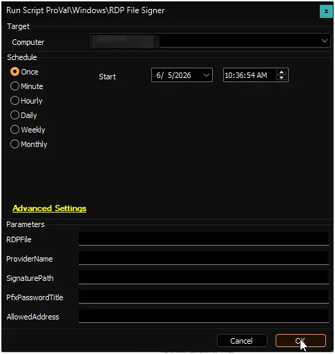
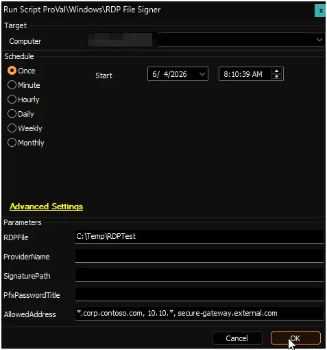
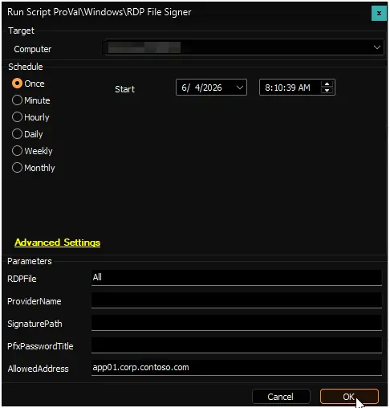
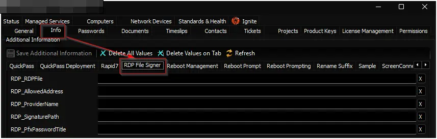

## Summary

This script digitally signs Remote Desktop Protocol (.rdp) files on your Windows device and installs the signing certificate so that signed RDP files open without security warnings.

After signing, the certificate is automatically trusted by Windows, preventing publisher warnings when users open the RDP files. The script can sign individual files, entire directories, or all RDP files on the device. Additionally, it offers optional address validation to ensure files are only signed if they point to pre-approved destination environments or wildcards.

## What It Does

The script obtains a signing certificate in one of two ways:

1. **Auto-generated certificate** - If you do not provide a certificate, the script creates a self-signed certificate on the device and uses it immediately.
2. **Provided certificate** - If you supply a certificate path and password, the script imports that certificate and uses it for signing.

Before applying the signature, the script can check the connection target defined within the `.rdp` file. If an address whitelist is provided, the script validates the destination address—supporting exact matches, arrays, or wildcards—and safely aborts the signing process for any unapproved or missing configurations.

After successful verification and signing, the certificate thumbprint is registered in Windows so RDP files stay trusted on that device.

## Sample Run

### Scenario 0: Import EDFs

Run the script without any parameters right after freshly importing it against any online Windows machine. The script will check if the required Extra Data Fields (EDFs) exist in your system. If they are missing, it will create them automatically.

> **Note:** Most of our scripts include a `Set_Environment` parameter to create EDFs and properties. This script already uses the maximum 5 ConnectWise Automate parameters, so `Set_Environment` is not available here. After import, run the script once on an online Windows machine with all parameters blank to create the required EDFs.

**User Parameters:**
Leave all parameters blank.

**Expected Output:**

- Script executes and validates the environment.
- Client-level EDFs are created under the "RDP File Signer" section.

### Scenario 1: Sign All RDP Files with Auto-Generated Certificate

Run the script without SignaturePath or PfxPasswordTitle. The script will:

- Create a self-signed certificate on the device.
- Find all .rdp files on the device.
- Sign each file.
- Register the certificate as trusted.

**User Parameters:**

- RDPFile = `All`
- ProviderName = (leave blank for default)
- SignaturePath = (leave blank)
- PfxPasswordTitle = (leave blank)
- AllowedAddress = (leave blank)

**Expected Output:**

- RDP files are signed.
- Certificate is trusted on the device.
- Users can open signed RDP files without warnings.

### Scenario 2: Sign Specific RDP Files with Auto-Generated Certificate

Run the script with one or more RDP file paths. The script will sign only those files with an auto-generated certificate.

**User Parameters:**

- RDPFile = `C:\Temp\Session1.rdp` or `C:\Temp\Session1.rdp, C:\Temp\Session2.rdp, C:\Custom Directory\RDP Sessions`
- ProviderName = (leave blank for default)
- SignaturePath = (leave blank)
- PfxPasswordTitle = (leave blank)
- AllowedAddress = (leave blank)

**Expected Output:**

- Only the specified files are signed.
- Certificate is trusted on the device.

### Scenario 3: Sign RDP Files in a Directory

Run the script with a directory path. The script will find and sign all .rdp files in that directory and its subdirectories.

**User Parameters:**

- RDPFile = `C:\ProgramData\RDP Sessions`
- ProviderName = (leave blank for default)
- SignaturePath = (leave blank)
- PfxPasswordTitle = (leave blank)
- AllowedAddress = (leave blank)

**Expected Output:**

- All .rdp files in the directory tree are signed.
- Certificate is trusted on the device.

### Scenario 4: Sign RDP Files with a Provided Certificate

Run the script with a certificate path and its password title. Before running, store the PFX password in a ConnectWise Automate client-level password entry.

**User Parameters:**

- RDPFile = `All`
- ProviderName = (leave blank)
- SignaturePath = `\\fileserver\share\RDPSigner.pfx` or `https://internal.corp/certs/RDPSigner.pfx`
- PfxPasswordTitle = `RDP Signer Password` (title of the password entry you created)
- AllowedAddress = (leave blank)

**Steps:**

1. Create a client-level password entry with the PFX password.
2. Note the exact title of the password entry.
3. Run the script with the certificate path and password title.

**Expected Output:**

- RDP files are signed with your provided certificate.
- Certificate is trusted on the device.
- Users open RDP files with your organization's certificate, not a self-signed one.

### Scenario 5: Custom Certificate Provider Name

Run the script with a custom provider name for the certificate. This name appears in certificate properties.

**User Parameters:**

- RDPFile = `All`
- ProviderName = `Contoso RDP Signer`
- SignaturePath = (leave blank for auto-generated)
- PfxPasswordTitle = (leave blank)
- AllowedAddress = (leave blank)

**Expected Output:**

- RDP files are signed with a self-signed certificate using your custom provider name.
- Certificate properties show "Contoso RDP Signer" as the issuer.

### Scenario 6: Sign RDP Files with Address Whitelisting (Wildcards & Arrays)

Run the script while specifying allowed connection targets. This filters out files pointing to unapproved network destinations or files that completely lack a `full address` configuration block.

**User Parameters:**

- RDPFile = `C:\Temp\RDPTest`
- ProviderName = (leave blank for default)
- SignaturePath = (leave blank)
- PfxPasswordTitle = (leave blank)
- AllowedAddress = `*.corp.contoso.com, 10.10.*, secure-gateway.external.com`

**Expected Output:**

- Files pointing to `app01.corp.contoso.com` or `10.10.4.20` are verified and successfully signed.
- Files pointing to an unapproved external address (e.g., `rogue.hackers.net`) are bypassed with a warning and left unsigned.
- Template RDP files containing an empty or missing `full address` property fail validation and are skipped.

### Scenario 7: Sign RDP Files for a Single Approved Destination Only

Run the script with an exact, single address to ensure extreme strictness. This is useful if you are deploying a dedicated RDS gateway or a single critical server and want to guarantee no other RDP files are accidentally trusted.

**User Parameters:**

- RDPFile = `All`
- ProviderName = (leave blank for default)
- SignaturePath = (leave blank)
- PfxPasswordTitle = (leave blank)
- AllowedAddress = `app01.corp.contoso.com`

**Expected Output:**

- The script scans the device but **only** signs RDP files where the target connection is exactly `app01.corp.contoso.com`.
- Files pointing to any other server (e.g., `app02.corp.contoso.com`), external IP addresses, or those missing a target are explicitly skipped and left unsigned.
- A single trusted connection path is established for the end-user.

## User Parameters

*Note: All User Parameters take precedence over Client-level EDFs. If a User Parameter is left blank, the script will fall back to the corresponding Client-level EDF value.*

| Name | Required | Example | Description |
| --- | --- | --- | --- |
| RDPFile | True* | `all` or `C:\Temp\Session1.rdp, C:\Temp\Session2.rdp` | Set to `all` to sign every RDP file on the device. Or provide one or more file paths. Directories are searched recursively. *Required unless set via EDF.* |
| ProviderName | False | `Contoso RDP Signer` | Optional name for the auto-generated certificate. If left blank, defaults to `RDP File Signer`. Only used when SignaturePath is not provided. |
| SignaturePath | False | `\\fileserver\share\RDPSigner.pfx` or `https://internal.corp/certs/RDPSigner.pfx` | Optional path to a PFX certificate file. Can be a local path, UNC path, or download URL. If left blank, a self-signed certificate is created on the device. |
| PfxPasswordTitle | False | `RDP Signer Password` | Title of the client-level password entry containing the PFX password. Only required if you provide a SignaturePath. |
| AllowedAddress | False | `*.corp.contoso.com` or `10.10.*, 192.168.1.50` | Optional single value or comma-separated array of approved connection strings. Supports PowerShell wildcards (`*`, `?`). |

## Extra Data Fields (EDFs)

| Name | Level | Section | Example | Accepted Values | Description |
| :--- | :--- | :--- | :--- | :--- | :--- |
| RDP_RDPFile | Client | RDP File Signer | `all` or `C:\Temp\Session.rdp` | String | Paths to .rdp files/directories, or "All" for full machine search. A runtime parameter will override this. |
| RDP_AllowedAddress | Client | RDP File Signer | `*.corp.contoso.com, 10.10.*` | String | Whitelist of allowed RDP target addresses (supports wildcards, comma separated). A runtime parameter will override this. |
| RDP_ProviderName | Client | RDP File Signer | `Contoso RDP Signer` | String | Custom name for the auto-generated self-signed certificate. A runtime parameter will override this. |
| RDP_SignaturePath | Client | RDP File Signer | `\\server\share\RDPSigner.pfx` | String | URL, UNC, or local path to a PFX certificate file. A runtime parameter will override this. |
| RDP_PfxPasswordTitle | Client | RDP File Signer | `RDP Signer Password` | String | Title of the password entry in the Automate Passwords tab for the PFX. A runtime parameter will override this. |

## Output

- Script logs

## FAQ

**Q: How do the client-level EDFs interact with the Script Parameters?**

**A:** Runtime parameters always take priority. If you provide a runtime value, that value is used. If left blank, the script uses the client's EDF value for that field.

**Q: Do I have to use the EDFs?**

**A:** No, you can continue using standard runtime parameters for ad-hoc or single-device runs. EDFs are simply there to allow you to configure a baseline policy across an entire client so you can run the script against multiple devices without re-typing parameters.

**Q: What happens if I do not provide a certificate?**

**A:** The script creates a self-signed certificate on the device automatically. This certificate is trusted locally so signed RDP files open without warnings on that device.

**Q: Where do I store the PFX password?**

**A:** Create a client-level password entry in ConnectWise Automate under Clients > [Select Client] > Password Manager. Use any descriptive title (for example, "RDP Signer Password" or "RDP Certificate Password"). Then pass that exact title in the PfxPasswordTitle parameter or EDF.

**Q: Can I use a certificate from my organization?**

**A:** Yes. Provide the certificate path in SignaturePath (UNC path, local path, or URL) and the password title in PfxPasswordTitle. The script downloads or imports the certificate and uses it to sign RDP files.

**Q: Will the script create a new self-signed certificate every time it runs?**

**A:** No. The script reuses the same valid certificate on that device for future runs. A new self-signed certificate is created only if the existing certificate has expired or if you change the ProviderName value.

**Q: I am storing the PFX file on a file server. What permissions do I need to set?**

**A:** The script runs as `SYSTEM`, so the file share must allow read access for that context. Grant read access to `NT AUTHORITY\SYSTEM` or `Everyone` on the certificate folder. If access is limited to domain users only, the script cannot read the PFX file.

**Q: What if I have RDP files in multiple locations?**

**A:** You can pass multiple paths to the RDPFile parameter using an array format: `C:\Temp\Session1.rdp, C:\Temp\Session2.rdp, C:\Custom Directory\RDP Sessions`. Or use `all` to sign every RDP file on the device.

**Q: Do I need to run this script multiple times?**

**A:** No. Run it once per device. The certificate is registered as trusted, so all signed RDP files remain trusted on that device. If you later create new RDP files, run the script again to sign them.

**Q: How does the destination address whitelisting work?**

**A:** If you set `AllowedAddress`, the script checks each `.rdp` file before signing. It reads the `full address:s:` value and compares it to your allow list. Matching files are signed. Non-matching files are skipped.

**Q: Can I pass multiple domains or IP ranges to AllowedAddress?**

**A:** Yes. It accepts comma-separated values. You can combine exact hostnames, IP ranges, and wildcard domains in one parameter (for example, `*.domain.com, 10.20.*, desktop05.lan`).

**Q: What happens if an RDP file does not have a "full address" property when whitelisting is active?**

**A:** The script treats this as a validation failure, logs a warning, and skips the file without signing it.

**Q: Where do I check if the script succeeded?**

**A:** Check the script logs. Or verify manually by opening an RDP file and confirming it opens without a security warning.

## Changelog

### 2026-06-05

- Added support for Client-level Extra Data Fields (EDFs) to establish baseline configurations and implemented automated EDF creation on the first run.

### 2026-06-04

- Added a destination validation feature via the new optional `AllowedAddress` parameter.

### 2026-05-25

- Initial version of the document.
