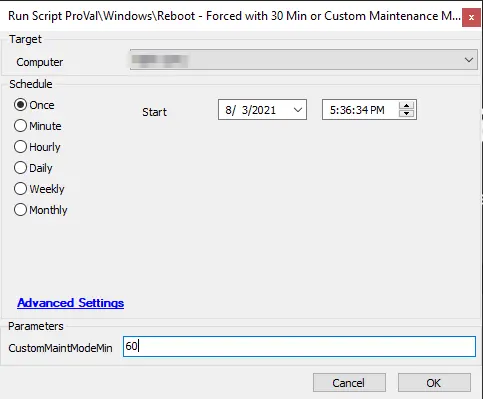

## Summary

This script is designed to set maintenance mode for 30 minutes for servers and 15 minutes for workstations before executing the shell command that will cause the machine to reboot immediately.

If the user wishes to specify the duration manually, they can enter the time in the parameter `CustomMaintModeMin`, which will set maintenance mode for the duration entered.

**Note:** This is a maintenance-style script that is allowed to run even if a machine is in maintenance mode.

**Time Saved by Automation:** 5 Minutes

## Sample Run

**Target:** Windows Device  

#### User Parameters

| Name                  | Example | Required | Description                                                                                                                                                                                                                          |
|-----------------------|---------|----------|--------------------------------------------------------------------------------------------------------------------------------------------------------------------------------------------------------------------------------------|
| CustomMaintModeMin    | 60      | False    | This is the user-entered parameter for the maintenance mode duration. If no value is entered, the target machine will receive either a 30-minute maintenance mode (servers) or a 15-minute maintenance window (workstations). This parameter must be a numerical value. |

## Process

The script will first determine if the user parameter was filled out. If it was not filled out, the script will proceed to the "Then" section and use the default maintenance mode windows of 30 minutes for servers or 15 minutes for workstations. If the script determines that the user parameter was filled out, it will jump to the "Else" section.

**"Then" Section**  
The script will exit with an error for non-Windows OS.  
The script will enable maintenance mode for 30 minutes for servers or 15 minutes for workstations and then issue a Windows CLI command to restart the device.  
The script will then exit on success.

**"Else" Section**  
The script will exit with an error for non-Windows OS.  
The script will ensure that the user parameter is valid (this parameter must be a numerical value; for example, to have the script set a 60-minute maintenance mode, please enter 60).  
If the parameter is not valid, the script will exit with a log message indicating that the value was not entered properly. Otherwise, the script will put the machine into maintenance mode for the duration entered by the user.  
The script will then issue a Windows CLI command to restart the device and exit successfully.

## Output

Script log messages