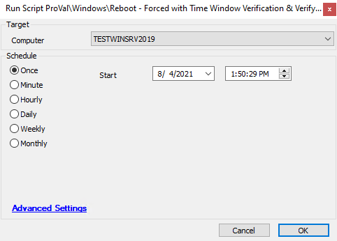

## Summary

This script will reboot a machine, but only if it is within a preconfigured time window. The window is NOT configured by default.

**Time Saved by Automation:** 5 Minutes

## Sample Run

## Dependencies

- Global variables must be set up correctly.

## Variables

- `@PSResult@` -> Output from the PowerShell time window check
- `@MachineTime@` -> Grabs the local time of the machine
- `@newuptime@` -> Gets the latest uptime from the Automate Database

#### Global Parameters

| Name        | Example                                                                                                                                                        | Required | Description                       |
|-------------|----------------------------------------------------------------------------------------------------------------------------------------------------------------|----------|-----------------------------------|
| WindowStart | 0 = Midnight, 1 = 1:00 AM, 5 = 5:00 AM, 11 = 11:00 AM, 23 = 11:00 PM                                                                                     | True     | When is the window open to reboot |
| WindowEnd   | 0 = Midnight, 1 = 1:00 AM, 5 = 5:00 AM, 11 = 11:00 AM, 23 = 11:00 PM                                                                                     | True     | When is the window closed to reboot |

## Process

1. Convert the window variables to integers and run a comparison to see if the machine is allowed to reboot during this window.
2. Grab the local machine time.
3. Check if the current time (when trying to run the script) is within the reboot window.
4. If it is, reboot the machine and verify that the reboot was successful.
   1. If the reboot fails or shows uptime > 1800 seconds, create a ticket.
   2. If successful, log success in the script logs.
5. If not within the window:
   1. Log that the machine time is not within the window and exit the script.

## Output

- Script log

