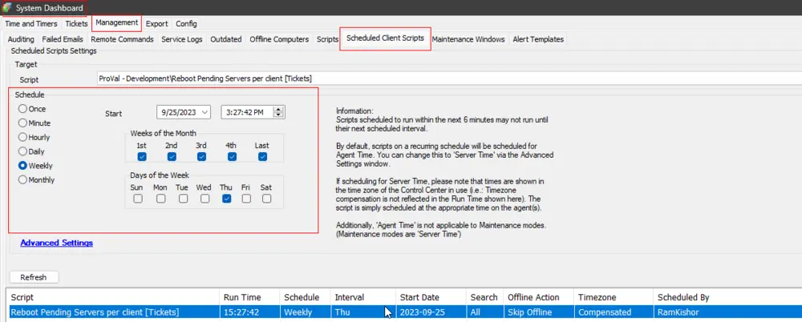
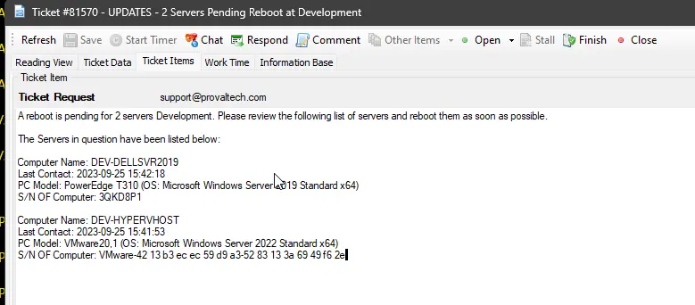
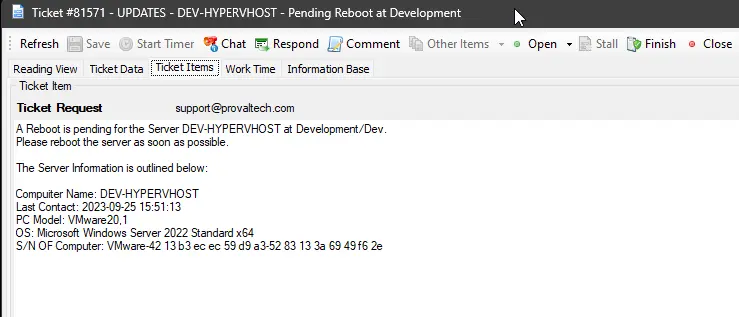

## Summary

The script generates a client-level ticket containing details about all pending server reboots for that client. However, if a client has only one server awaiting a reboot, the script will generate a ticket at the computer level.

The script will close tickets for servers that no longer have pending reboots and for clients with no pending server reboots. It won't generate new tickets for servers with pending reboots if there's already an existing ticket. It will re-create client-level tickets with current information after closing the previous ticket(s).

## Sample Run

It is a client script and is suggested to schedule it to run at regular intervals.  

## Dependencies

[CWM - Automate - Script - Reboot Pending Servers per Client - Tickets Management](/docs/0d5f27c6-fa65-4a98-b32d-61426505aa1c)

## Output

- Tickets

## Sample Tickets

**Client-Level Ticket:**  
  

**Computer-Level Ticket:**  
