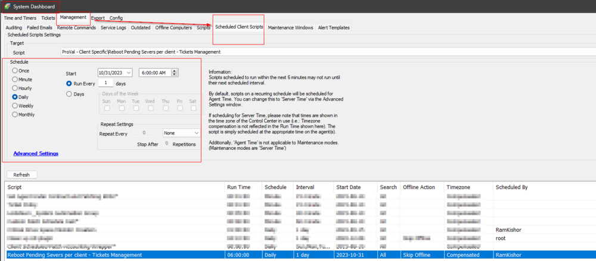

## Summary

This client script is designed to close the Reboot Pending tickets created by the [CWM - Automate - Script - Reboot Pending Servers per client - Ticket Creation](/docs/9be930d0-0f3e-40c2-8135-3a77e59a1e9e) script.

Tickets will automatically close for servers that have already been rebooted and for clients where there are no pending server reboots.

## Sample Run

It is recommended to schedule this client script to run once per day for better results.

## Dependencies

[CWM - Automate - Script - Reboot Pending Servers per client [Tickets]](/docs/9be930d0-0f3e-40c2-8135-3a77e59a1e9e)

