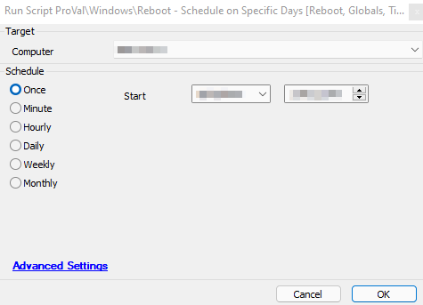

## Summary

This script schedules a reboot for the next applicable day at the specified time on a target machine. For Hyper-V hosts, the script will also create a ticket indicating that the reboot has been scheduled.

**Time Saved by Automation:** 10 Minutes

## Sample Run

## Dependencies

None

## Variables

`@psout@` - Contains the results from the PowerShell script run in line 5.

#### Global Parameters

| Name                     | Example                       | Required | Description                                                                                              |
|--------------------------|-------------------------------|----------|----------------------------------------------------------------------------------------------------------|
| DAYS_TO_REBOOT           | "Tuesday","Wednesday"         | True     | Must be a comma-separated list of strings in double quotes with the names of the days of the week to reboot. |
| HOUR_TO_REBOOT           | 13                            | True     | The hour of the day to reboot in a 24-hour format. (13 = 1:00 PM, etc.)                                 |
| MINUTE_TO_REBOOT         | 15                            | True     | The minute of the hour to reboot. Supports values from 0 - 59                                          |
| MAINTENANCE_TIME         | 15                            | True     | The time in minutes for the maintenance window to last.                                                |
| MAINTENANCE_COMMENT      | Scheduled Reboot              | True     | The comment to add into the maintenance window.                                                          |
| TicketCreationCategory    | 100                           | True     | The ticket category to route this ticket to the appropriate board and priority. (For Hyper-V Hosts only) |

## Process

This script schedules a reboot for the next applicable day at the specified time on a target machine. Once the reboot is scheduled, the maintenance window is set for the reboot time, and the length is determined by a global variable. If the target machine is a Hyper-V server, a maintenance window will also be set for all discovered child machines. A ticket is then generated to make the support team aware of the reboot.

**To cancel the reboot after it is scheduled, type "shutdown /a" in a command prompt window. This will abort the scheduled restart.**

## Output

- Script log messages
- Ticket (For Hyper-V hosts only)

