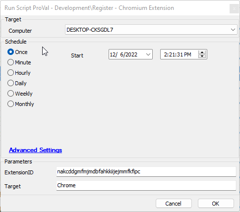

## Summary

This script will enable extensions for the following Chromium-based browsers:

- Chromium
- Google Chrome
- Microsoft Edge
- Brave
- Vivaldi

**Note:** Microsoft Edge may ignore policy settings on devices that are not managed, and some Windows releases do not accept MDM policies.

## Sample Run

Installs the N-Able Passportal extension for the Chrome browser.  
When selecting multiple browsers, use 'Chrome', 'Edge', 'Brave', etc.  
If setting all available browsers, leave the Target blank.

## Dependencies

- [SWM - Software Configuration - Register-ChromiumExtension](/docs/481992c0-adcd-4275-bd5c-aa59fd4a7b17)

#### User Parameters

| Name        | Example                                      | Required | Description                                         |
|-------------|----------------------------------------------|----------|-----------------------------------------------------|
| ExtensionID | nakcddgmfmjmdbfahkkiijejmmfkfipc            | True     | The Extension ID from the Google Chrome Store.      |
| Target      | 'Chromium', 'Chrome', 'Edge', 'Brave', 'Vivaldi' | False    | The browser or browsers to enable the extension for. Will target all available if left blank. |

## Output

- Script log

