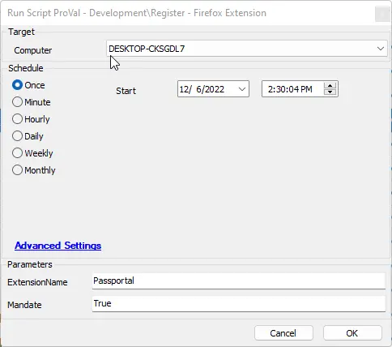

## Summary

This document will guide you through the process of registering a given extension for the Firefox browser.

## Sample Run

  
This will install the N-Able Passportal extension and make that extension protected from deletion.  
Leaving the Mandate blank will not protect the extension from deletion.  
Obtain your extension name from the Firefox extension store.

## Dependencies

This should be a list of ITGlue documents listed in the Related Items sidebar on which this script depends.

- [SWM - Software Configuration - Register-FirefoxExtension](/docs/db0512b5-70cd-4145-aa69-de84f9b1846d)

#### User Parameters

| Name          | Example     | Required | Description                                      |
|---------------|-------------|----------|--------------------------------------------------|
| ExtensionName | Passportal  | True     | The name of the extension you wish to install    |
| Mandate       | True        | False    | Set to True to protect the extension from removal.|

## Process

Please review the agnostic content for specifics on the process.

## Output

- Script log
