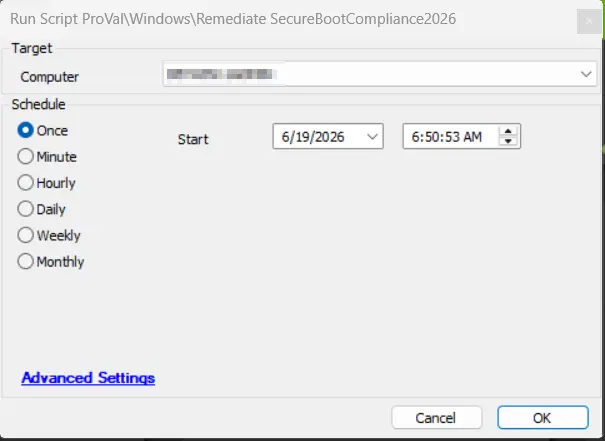

## Summary

This script uses the agnostic script [Agnostic Script - Remediate SecureBootCompliance2026](/docs/062c5b72-32b5-4fdb-b48c-5f45a19af42c) to run the Automate implementation of the PS1 on the Windows 2026 agents, so that it can remediate UEFI Secure Boot compliance for Windows 2026 by ensuring systems have the required 2023 UEFI certificates (KEK and DB), enabling Microsoft-managed certificate updates, and reporting the remediation status. It validates Secure Boot, configures registry keys for automatic updates, monitors servicing status, and logs results.

## Dependencies

- [Agnostic Script - Remediate SecureBootCompliance2026](/docs/062c5b72-32b5-4fdb-b48c-5f45a19af42c)

## Sample Run

## Global Parameters

| Name | Required | Example | Description   |
|---------|---------|---------|---------|
| Debug | False | True/False | If set to True, then it will display the complete log before the script comparator; else, it will return after the script output analysis. |
| ScriptEngineEnableLogger | False | True/False | If set to True, then the script log will show the complete script execution analysis step-by-step; otherwise, the step-by-step analysis will be hidden in the script log. |

## Output

- Script Logs
- [Dataview - Boot Environment Audit](/docs/539d13a0-9444-4b40-8b09-aebf34ade1f8)

## Changelog

- Updated the agnostic script as it has the unicode in it that leading to the Invalid-code signature error.
- Initial version of the document
