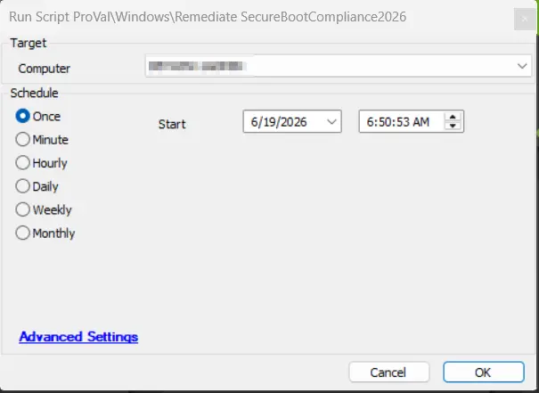

## Summary

This script uses the agnostic script [Remediate-SecureBootCompliance2026](/docs/062c5b72-32b5-4fdb-b48c-5f45a19af42c) to run the Automate implementation of the PS1 on Windows 2026 agents.

It remediates UEFI Secure Boot compliance for Windows 2026 by ensuring systems have the required 2023 UEFI certificates, `KEK` and `DB`, enabling Microsoft-managed certificate updates, and reporting the remediation status.

The script validates Secure Boot, configures the required registry keys for automatic certificate updates, monitors the Secure Boot servicing status, logs the results, and writes a script state to prevent the same machine from being repeatedly targeted by the autofix internal monitor.

After each run, the script also takes one ticket action: it closes, creates, or updates a ConnectWise ticket so your team always knows which devices need action.

## Script State

This script writes the following script state after the remediation workflow has been processed:

| Variable | Value | Purpose |
|---|---|---|
| `Boot_Environment_Remediation` | `Applied` | Prevents the [Secure Boot CA2023 Autofix Targets](/docs/adc5c5dd-ef5c-4f8d-a687-e613a4291b2c) internal monitor from repeatedly running the remediation script against the same machine. |

The internal monitor excludes computers where this script state is already present with a value of `Applied`.

If remediation needs to be run again on a device, remove or reset the `Boot_Environment_Remediation` script state for that computer.

## Dependencies

- [Agnostic Script: Remediate-SecureBootCompliance2026](/docs/062c5b72-32b5-4fdb-b48c-5f45a19af42c)
- [Solution: Boot Environment Audit](/docs/539d13a0-9444-4b40-8b09-aebf34ade1f8)

## Sample Run



## Global Parameters

| Name | Required | Example | Description |
|---|---|---|---|
| Debug | False | True/False | If set to True, then it will display the complete log before the script comparator; otherwise, it will return after the script output analysis. |
| ScriptEngineEnableLogger | False | True/False | If set to True, then the script log will show the complete script execution analysis step-by-step; otherwise, the step-by-step analysis will be hidden in the script log. |
| FailureTicket | False | True/False | Controls all ticket actions. When True (default), blocked devices create tickets and compliant devices close open tickets. When False, the script creates, comments on, and closes no tickets. |
| RebootRequiredTicket | False | True/False | Creates a ticket when the update is staged and waiting for a restart, or still being delivered by Microsoft. Default is False, so pending devices stay silent. |

## Ticketing

After each run, the script takes exactly one ticket action based on the device state:

| Device state | Result label | Ticket action | Controlled by |
|---|---|---|---|
| Fully compliant | COMPLETED | Closes any open ticket. Never creates one. | Always |
| Blocked, needs manual action | FAILED | Creates a ticket, or comments on the existing one. | `FailureTicket` |
| Pending restart or delivery | PENDING | Creates a ticket, or comments on the existing one. | `RebootRequiredTicket` |

**No duplicate tickets.** The script looks for an open ticket on the computer whose subject starts with `Secure Boot 2026`. If one exists, the new run is added as a comment. If the device later becomes compliant, the open ticket is closed automatically.

**Subject format:** `Secure Boot 2026 - [Result] - [Reason] - [Computer Name]`

### 1. Fully compliant - no ticket

- **When it happens:** Secure Boot is enabled and both 2023 certificates are enrolled in the firmware.  
- **What you see:** No ticket is created. If a previous run opened a ticket on this computer, this run closes it. Run details remain available in the script log.

### 2. Blocked - Secure Boot disabled

- **When it happens:** Secure Boot is turned off in the UEFI firmware.
- **What you see:** A ticket is created (`FailureTicket` is True by default), or a comment is added to the existing ticket.

**Example subject:** `Secure Boot 2026 - FAILED - Secure Boot Disabled - WIN-PC-091`

**Example body:**

```text
Computer: WIN-PC-091
Result: FAILED
Detected State: Secure Boot Disabled

--- REASON ---
Reason: Secure Boot is disabled in the UEFI firmware of this computer. The 2023 Secure Boot certificate update is only delivered to devices that have Secure Boot enabled.

--- RECOMMENDATION ---
Action 1: Enable Secure Boot in the UEFI firmware setup of this computer. This change cannot be made from Windows and needs firmware access. Run this automation again afterwards.

--- AUDIT DETAILS ---
SecureBoot      : Disabled
DbCertificate   : Out of date
KekCertificate  : Out of date
FirmwareVersion : 1.15.0
FirmwareLevel   : Compliant

--- REMEDIATION LOGS ---
Secure Boot is Disabled.
ACTION REQUIRED: Enable Secure Boot in BIOS/UEFI
```

### 3. Blocked - firmware outdated

- **When it happens:** The installed BIOS version is below the vendor minimum for the 2023 certificates.
- **What you see:** A ticket is created, or a comment is added to the existing ticket.

**Example subject:** `Secure Boot 2026 - FAILED - BIOS Update Required - WIN-PC-091`

**Example body:**

```text
Computer: WIN-PC-091
Result: FAILED
Detected State: BIOS Update Required

--- REASON ---
Reason: The installed firmware version 1.12.0 is lower than version 1.18.0, which the hardware vendor lists as the minimum firmware level for the 2023 Secure Boot certificates.

--- RECOMMENDATION ---
Action 1: Update the system firmware of this computer to version 1.18.0 or later, then run this automation again.

--- AUDIT DETAILS ---
SecureBoot            : Enabled
DbCertificate         : Not present
KekCertificate        : Not present
FirmwareName          : Dell Inc.
FirmwareVersion       : 1.12.0
Ca2023MinimumFirmware : 1.18.0
FirmwareLevel         : Outdated

--- REMEDIATION LOGS ---
Secure Boot Enabled - Proceeding
Setting registry keys for Microsoft-managed updates...
```

### 4. Blocked - cumulative update missing

- **When it happens:** The November 2025 (or later) Windows cumulative update is not installed. That update carries the certificate servicing logic.
- **What you see:** A ticket is created, or a comment is added to the existing ticket.

**Example subject:** `Secure Boot 2026 - FAILED - Cumulative Update Required - WIN-PC-091`

**Example body:**

```text
Computer: WIN-PC-091
Result: FAILED
Detected State: Cumulative Update Required

--- REASON ---
Reason: The November 2025 or later Windows cumulative update is not installed on this computer, and the certificate servicing logic ships in that update. Latest detected cumulative update: 2024-10 Cumulative Update for Windows 11.

--- RECOMMENDATION ---
Action 1: Install the November 2025 or later Windows cumulative update on this computer and restart the device.

--- AUDIT DETAILS ---
SecureBoot             : Enabled
LatestCumulativeUpdate : 2024-10 Cumulative Update
CumulativeUpdateLevel  : Outdated
ServicingStatus        : Not exist

--- REMEDIATION LOGS ---
Secure Boot Enabled - Proceeding
Checking current certificate status...
```

### 5. Pending - reboot required

- **When it happens:** Windows staged the certificate update and is waiting for a restart (the firmware update sequence needs two restarts).  
- **What you see:** A ticket only appears if you set `RebootRequiredTicket` to True. By default, pending devices stay silent and resolve on the next run.

**Example subject:** `Secure Boot 2026 - PENDING - Reboot Required - WIN-PC-091`

**Example body:**

```text
Computer: WIN-PC-091
Result: PENDING
Detected State: Reboot Required

--- REASON ---
Reason: Windows has staged the 2023 certificate update on this computer and is waiting for a restart. Servicing status: In progress, restart required.

--- RECOMMENDATION ---
Action 1: Restart this computer twice so the firmware certificate update sequence can complete, then run this automation again to confirm the certificates are enrolled.

--- AUDIT DETAILS ---
SecureBoot     : Enabled
DbCertificate  : Out of date
KekCertificate : Out of date
ServicingStatus: In progress, restart required
ServicingError : 0

--- REMEDIATION LOGS ---
Secure Boot Enabled - Proceeding
UEFICA2023Status: In Progress - Reboot Required
ACTION REQUIRED: Reboot device TWICE to complete certificate update
```

### 6. Pending - awaiting certificate delivery

- **When it happens:** The device is fully patched with Secure Boot enabled, but Microsoft has not yet delivered the certificate payload to this device via Windows Update.
- **What you see:** A ticket only appears if `RebootRequiredTicket` is True. By default, nothing is created and the device typically resolves itself in a later Windows Update cycle.

**Example subject:** `Secure Boot 2026 - PENDING - Awaiting Certificate Delivery - WIN-PC-091`

**Example body:**

```text
Computer: WIN-PC-091
Result: PENDING
Detected State: Awaiting Certificate Delivery

--- REASON ---
Reason: The 2023 Secure Boot certificates are not enrolled on this computer yet and no blocking condition was detected. Microsoft stages the certificate delivery across several Windows Update cycles.

--- RECOMMENDATION ---
Action 1: Keep this computer online and fully patched. Run this automation again in the coming weeks to confirm the certificates are enrolled.

--- AUDIT DETAILS ---
SecureBoot            : Enabled
DbCertificate         : Out of date
KekCertificate        : Out of date
ServicingStatus       : Not started
FirmwareLevel         : Compliant
CumulativeUpdateLevel : Current

--- REMEDIATION LOGS ---
Secure Boot Enabled - Proceeding
PENDING: Certificate updates will be delivered via Windows Update
```

### 7. Blocked - execution or audit error

- **When it happens:** The run was blocked (for example by antivirus), or the boot environment audit could not return data.
- **What you see:** A ticket is created, or a comment is added to the existing ticket.

**Example subject:** `Secure Boot 2026 - FAILED - Execution Error - WIN-PC-091`

**Example body:**

```text
Computer: WIN-PC-091
Result: FAILED
Detected State: Execution Error

--- REASON ---
Reason: The remediation run recorded one or more errors on this computer. The ERRORS section below lists the entries for this run.

--- RECOMMENDATION ---
Action 1: Review the ERRORS section below, resolve the reported failures, then run this automation again.

--- AUDIT DETAILS ---
The boot environment audit did not return data. Reason: The audit content completed without returning a boot environment object.

--- REMEDIATION LOGS ---
Secure Boot Enabled - Proceeding
Checking current certificate status...

--- ERRORS ---
Error retrieving certificate information: Access is denied
```

### Other possible subject reasons

| Subject reason | Meaning |
|---|---|
| `Secure Boot State Unknown` | The device boots in legacy BIOS/CSM mode or the firmware hides the Secure Boot variables. |
| `Certificate Servicing Error <code>` | Windows reported a servicing error while applying the certificates. The code appears in the subject and body. |
| `Diagnostic Data Disabled` | Windows diagnostic data is off, which pauses the Microsoft-managed certificate rollout. |
| `Remediation Did Not Run` | The remediation content could not execute on the device. |
| `Audit Data Unavailable` | The boot environment audit could not be downloaded or run. |
| `Implementation Signature Invalid` | The deployed script failed code-signature validation and refused to run. Redeploy it from the content repository. |

### Advisory notes that never create a ticket by themselves

These findings appear in the ticket body as extra reasons and recommendations, but only alongside a blocking condition or pending state:

- Pending vendor driver or firmware updates.
- PXE or network boot entries in the firmware.
- Non-Windows EFI boot loaders (verify they are signed with the 2023 CA before the db update).
- Windows Recovery Environment disabled.
- Computer model not listed in the vendor firmware matrix.

## Output

- Script Logs
- Script State
- Tickets (created, commented, or closed based on the device compliance state)

## Changelog

### 2026-08-11

- Added structured ticketing output to automatically create, update, or close ConnectWise tickets based on the device's compliance state.
- Introduced `FailureTicket` and `RebootRequiredTicket` parameters to give partners control over alert generation.

### 2026-08-04

- Added script state `Boot_Environment_Remediation = Applied` to prevent repeated execution by the [Secure Boot CA2023 Autofix Targets](/docs/adc5c5dd-ef5c-4f8d-a687-e613a4291b2c) internal monitor.
- Added dependency on the new Secure Boot CA2023 autofix internal monitor.
- Updated output documentation to include the new script state.
- Corrected the Boot Environment Audit dataview reference.

### 2026-06-19

- Initial version of the document.
