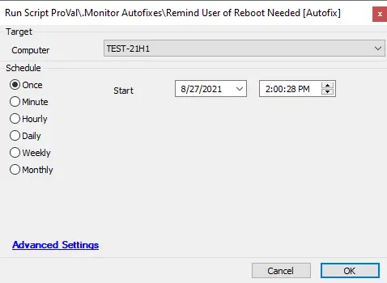

## Summary

This script sends a popup message to the logged-in user, reminding them to reboot their machine.  
It can only be used as an autofix for monitors that check for machines that have not been rebooted in the last 30 days.  

**Time Saved by Automation:** 2 Minutes

## Sample Run

## Process

- The script first verifies if the user is logged in. If not, it exits.
- If the user is logged in, it sends a popup message to remind them to reboot their machine.