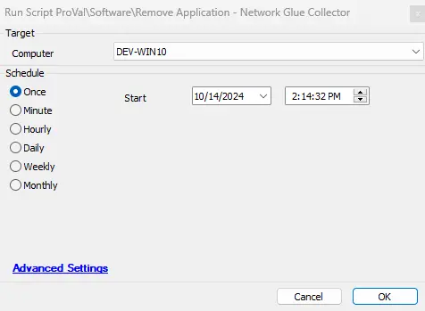
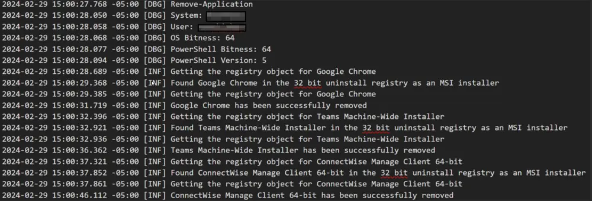

## Summary

This script is built to perform the uninstallation of the Network Glue Collector on demand or in conjunction with the offboarding script.

## Sample Run

## Dependencies

[Remove Application CWA Script](/docs/494f7109-e4b2-4ffa-93f8-e33089b09b4e)

## Variables

| Name             | Description                                                     |
|------------------|-----------------------------------------------------------------|
| ProjectName      | Remove-Application                                             |
| WorkingDirectory  | C:/ProgramData/_automation/script/Remove-Application          |
| PS1Log           | C:/ProgramData/_automation/script/Remove-Application/Remove-Application-log.txt |

### Global Parameters

| Name            | Example                     | Required | Description                                                                                                       |
|-----------------|-----------------------------|----------|-------------------------------------------------------------------------------------------------------------------|
| Name            | Network Glue Collector       | True     | This determines that this script will only uninstall the "Network Glue Collector" application from the endpoints. |
| Enable_Ticketing | 1                           | False    | If set to 1, the script will generate a ticket if it fails to remove the application.                           |

## Output

- Script log
- Log file on the end machine
- Ticket (if enabled)

## Ticketing

**Subject:** `Application Removal - Failed - %COMPUTERNAME%`

**Summary:**

`The script attempted to remove the provided list of application(s) from the computer, but it failed. Initially, the following application(s) were identified as installed out of the provided list:`

`- \<Comma Separated Name(s) of the application(s) out of the provided list installed initially on the computer>`

`However, the removal process failed for the following application(s):`

`- \<Comma Separated list of the application(s) out of the provided list that Automate failed to remove from the computer>`

`In addition to the primary removal script (Remove-Application.ps1), alternative uninstallation methods utilizing uninstall strings stored in Automate were also employed. Despite this, the script failed to remove all specified application(s).`

`Please refer to the attached log contents for further investigation. A manual review is required to identify the cause of the failure.`

**Comment:** `\<Contents of the Log file generated by the PowerShell Script>`

**Example:**  

