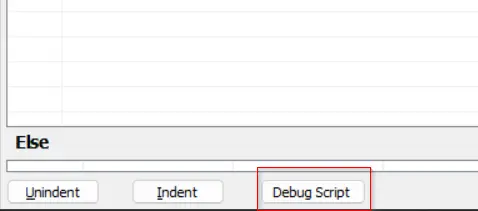

## Summary

The script can be used to remove the content of [Automate Server Monitoring](/docs/98773b6a-7986-4df2-90a5-fb559eefc50b) from the environment. Only the pieces emailing ProVal will be removed. There is an additional parameter that provides you with the option to remove the ProSyncClient Plugin as well.

It is developed as a client script to prevent accidental execution against any machine. Execute and Edit permissions are limited to the `Super Admin` only.

**WARNING: THIS IS A POTENTIALLY DESTRUCTIVE SCRIPT. DO NOT EXECUTE THE SCRIPT UNLESS YOU ARE 100% SURE. DO NOT IMPORT THE SCRIPT TO ANY PARTNER FOR ANY REASON. CONSULTANTS' CONSENT IS NECESSARY BEFORE EXECUTING THE SCRIPT. NEVER EXECUTE THE SCRIPT IN OUR (PROVAL'S) INTERNAL ENVIRONMENT.**

## Sample Run

A client script can either be debugged or executed against any client. The suggested method is to debug the script.

  
  

#### User Parameters

| Name                | Example | Required | Description                                                                                                                                                                   |
|---------------------|---------|----------|-------------------------------------------------------------------------------------------------------------------------------------------------------------------------------|
| AreYouSure?         | Yes     | True     | `Yes` to grant your consent to remove the Automate server monitoring; the script will not take any action if this parameter is left blank or provided with any other value. |
| ProSyncClientToo?   | Yes     | False    | `Yes` to grant your consent to remove the `ProSync` client from the environment. The `AreYouSure?` parameter must be set to `Yes` to use this parameter.                   |
| ThisScriptAsWell?   | Yes     | False    | `Yes` to remove this script from the environment after completing its work. The `AreYouSure?` and `ProSyncClientToo?` parameters must be set to `Yes` to use this parameter. |

## Process

- Remove the contents of [Automate Server Monitoring](/docs/98773b6a-7986-4df2-90a5-fb559eefc50b) from the environment if the `AreYouSure?` parameter is set to `Yes`; otherwise, exit.
- Remove the ProSyncClient plugin from the environment if the `ProSyncClientToo?` parameter is set to `Yes`; otherwise, exit.
- Remove itself from the environment if the `ThisScriptAsWell?` parameter is set to `Yes`; otherwise, exit.