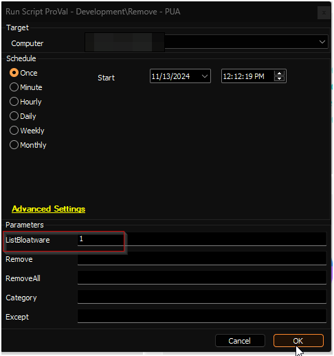
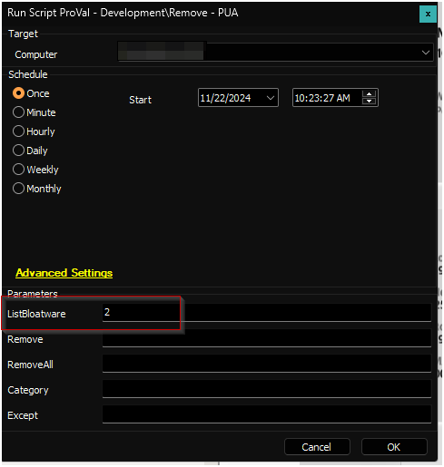
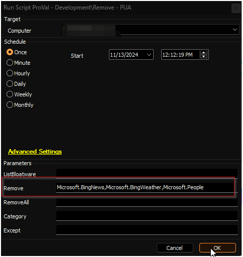
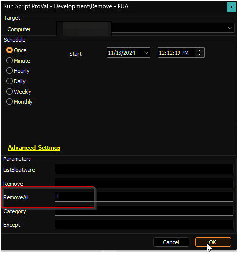
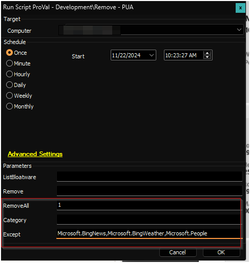
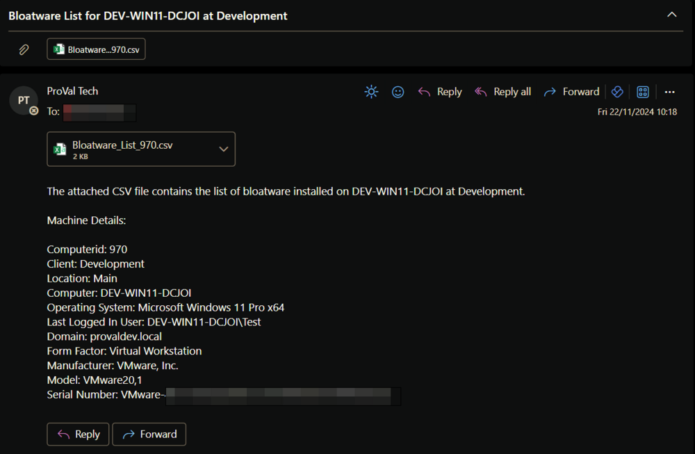
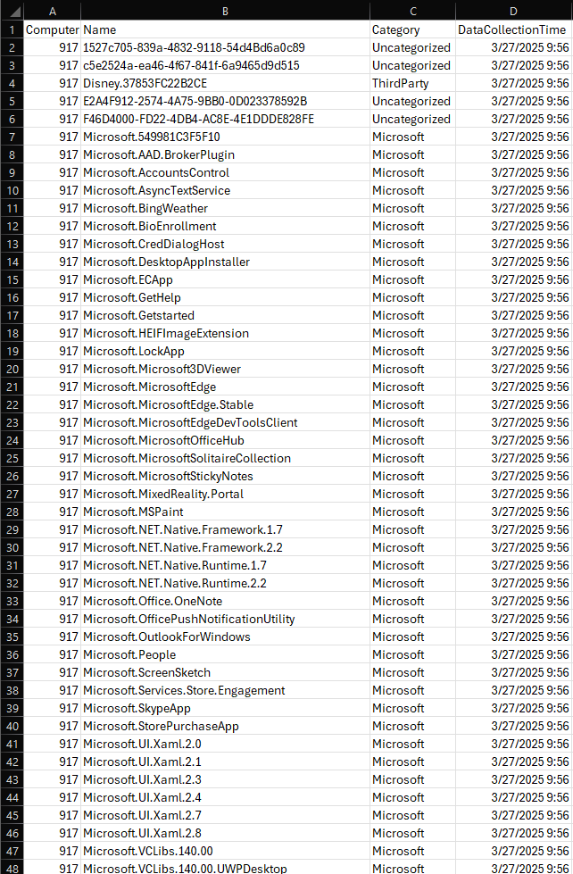

## Summary

A CWA implementation of the agnostic script [Remove-PUA](/docs/fda5f79b-3e83-4561-af2b-2533f41c7443). Data fetched by the script using the `ListBloatware` script can be viewed in the [Bloatware Audit](/docs/80011568-0974-4dee-b011-f6cd58384061) dataview.

## File Hash

**File Path:** `C:\ProgramData\_automation\Script\Remove-PUA\Manage-OverFlowedVariable.ps1`  
**File Hash (Sha256):** `79B76E6780B61ED657C7FC07C5C0D9A0662165066D5BAD95D9D672513BADD674`  
**File Hash (MD5):** `12B41CDBC04010E638D3FFB8A4BDB1D6`  

**File Path:** `C:\ProgramData\_automation\Script\Remove-PUA\Remove-PUA-AI.ps1`  
**File Hash (Sha256):** `193A1F83B0DE6B329C536DF02B3744C368E9247394C237103BC24DEF7267864E`  
**File Hash (MD5):** `01957AAF757A1B88704D4A3BB6DAAF29`  

**File Path:** `C:\ProgramData\_automation\Script\Remove-PUA\Remove-PUA.ps1`  
**File Hash (Sha256):** `84D43EDF2E800A1056ECE01B13C199F4F4900F58D2B0C5070A023936B098C84B`  
**File Hash (MD5):** `B20CBE9B008988A5991DE61DB1042BF3`  

## Sample Run

To fetch the list of installed bloatware into the [Bloatware Audit](/docs/80011568-0974-4dee-b011-f6cd58384061) dataview:  

To fetch the list of installed bloatware and email it to the user running the script:  

To remove specific bloatware `Microsoft.BingNews`, `Microsoft.BingWeather`, and `Microsoft.People`:  

To remove all installed bloatware supported by the script:  

To remove all installed bloatware supported by the script except `Microsoft.BingNews`, `Microsoft.BingWeather`, and `Microsoft.People`:  

## Dependencies

[SWM - Software Uninstall - Agnostic - Remove-PUA](/docs/fda5f79b-3e83-4561-af2b-2533f41c7443)  
[CWM - Automate - Script - OverFlowedVariable - SQL Insert - Execute](/docs/34cee8fe-1b6b-4558-a890-2face427ceb8)

## User Parameters

| Name          | Example                                          | Accepted Values                                                                                     | Required   | Description                                                                                                                                                                            |
|---------------|--------------------------------------------------|-----------------------------------------------------------------------------------------------------|------------|----------------------------------------------------------------------------------------------------------------------------------------------------------------------------------------|
| ListBloatware | 1                                                | - 1- 2                                                                                          | Partially  | `1`: Fetch installed bloatware into the [Bloatware Audit](/docs/80011568-0974-4dee-b011-f6cd58384061) dataview. `2`: Fetch installed bloatware into the [Bloatware Audit](/docs/80011568-0974-4dee-b011-f6cd58384061) dataview and send the list to the user running the script. |
| Remove        | Microsoft.BingNews, Microsoft.BingWeather, Microsoft.People |                                                                                                     | Partially  | The name(s) of the application or applications you wish to uninstall                                                                                                               |
| Remove All    | 1                                                |                                                                                                     | Partially  | Set it to 1 to remove all bloatware by category or all found bloatware with or without exceptions                                                                                   |
| Category      | XboxFeaturesApps                                | - MsftBloatApps - ThirdPartyBloatApps - WindowsStoreApps - XboxFeaturesApps - NonAppxApps | False      | Used with RemoveAll to filter bloatware to a certain category, allowing you to select just a specific category of bloatware                                                        |
| Except        | xboxGameOverlay                                 |                                                                                                     | False      | Used with RemoveAll or Category to remove all except some item(s) from a category or all together                                                                                   |

## Emailing

The script is designed to send the list of installed bloatware to the user running the script if the `ListBloatware` parameter is set to `2`.

**Sample Email:**  

**Sample CSV File:**  

## Output

- Script log
- Dataview (if `ListBloatware` parameter is used)

## Supported Bloatware

| MsftBloatApps                            | ThirdPartyBloatApps                       | WindowsStoreApps                       | XboxFeaturesApps                   | NonAppxApps                                             |
|------------------------------------------|-------------------------------------------|---------------------------------------|-----------------------------------|---------------------------------------------------------|
| Microsoft.3DBuilder                       | 46928bounde.EclipseManager                | Microsoft.DesktopAppInstaller         | Microsoft.Xbox.TCUI               | Clean Your Device                                       |
| Microsoft.AppConnector                    | 4DF9E0F8.Netflix                          | Microsoft.WindowsStore                 | Microsoft.XboxApp                 | Dell Optimizer Service                                  |
| Microsoft.BingFinance                     | 828B5831.HiddenCityMysteryofShadows      |                                       | Microsoft.XboxGameOverlay         | Dell Power Manager Service                               |
| Microsoft.BingNews                        | 89006A2E.AutodeskSketchBook               |                                       | Microsoft.XboxIdentityProvider    | Dell SupportAssist OS Recovery Plugin for Dell Update   |
| Microsoft.BingSports                      | 9E2F88E3.Twitter                          |                                       | Microsoft.XboxSpeechToTextOverlay | HP Notifications                                         |
| Microsoft.BingWeather                     | A278AB0D.DisneyMagicKingdoms             |                                       |  Microsoft.XboxLive                | HP TechPulse                                           |
| Microsoft.CommsPhone                      | A278AB0D.MarchofEmpires                  |                                       | Microsoft.XboxGamingOverlay        | Lenovo Quick Clean                                      |
| Microsoft.ConnectivityStore               | ActiproSoftwareLLC.562882FEEB491         |                                       |  Microsoft.GamingApp               | Lenovo Vantage Service                                   |
| Microsoft.Getstarted                       | AD2F1837.HPPCHardwareDiagnosticsWindows   |                                       |                                   |                                                         |
| Microsoft.Messaging                        | AD2F1837.HPPowerManager                   |                                       |                                   |                                                         |
| Microsoft.Microsoft3DViewer               | AD2F1837.HPPrivacySettings                |                                       |                                   |                                                         |
| Microsoft.MicrosoftOfficeHub               | AD2F1837.HPQuickDrop                      |                                       |                                   |                                                         |
| Microsoft.MicrosoftPowerBIForWindows      | AD2F1837.HPSupportAssistant               |                                       |                                   |                                                         |
| Microsoft.MicrosoftSolitaireCollection     | AD2F1837.HPSystemInformation              |                                       |                                   |                                                         |
| Microsoft.MicrosoftStickyNotes             | AD2F1837.myHP                             |                                       |                                   |                                                         |
| Microsoft.MinecraftUWP                    | AdobeSystemsIncorporated.AdobePhotoshopExpress |                                   |                                   |                                                         |
| Microsoft.MixedReality.Portal              | CAF9E577.Plex                             |                                       |                                   |                                                         |
| Microsoft.MSPaint                         | D52A8D61.FarmVille2CountryEscape          |                                       |                                   |                                                         |
| Microsoft.NetworkSpeedTest                | D5EA27B7.Duolingo-LearnLanguagesforFree  |                                       |                                   |                                                         |
| Microsoft.Office.OneNote                  | Drawboard.DrawboardPDF                    |                                       |                                   |                                                         |
| Microsoft.Office.OneNote                  | E046963F.cameraSettings                   |                                       |                                   |                                                         |
| Microsoft.Office.Sway                     | E046963F.LenovoCompanion                  |                                       |                                   |                                                         |
| Microsoft.OneConnect                       | E046963F.LenovoSettingsforEnterprise      |                                       |                                   |                                                         |
| Microsoft.People                          | Facebook.Facebook                          |                                       |                                   |                                                         |
| Microsoft.Print3D                         | flaregamesGmbH.RoyalRevolt2              |                                       |                                   |                                                         |
| Microsoft.RemoteDesktop                    | GAMELOFTSA.Asphalt8Airborne               |                                       |                                   |                                                         |
| Microsoft.SkypeApp                        | KeeperSecurityInc.Keeper                  |                                       |                                   |                                                         |
| Microsoft.Windows.Photos                  | king.com.BubbleWitch3Saga                 |                                       |                                   |                                                         |
| Microsoft.WindowsAlarms                   | king.com.CandyCrushSodaSaga               |                                       |                                   |                                                         |
| Microsoft.WindowsCamera                   | laregamesGmbH.RoyalRevolt2                |                                       |                                   |                                                         |
| microsoft.windowscommunicationsapps       | WhatsApp.WhatsAppDesktop                  |                                       |                                   |                                                         |
| Microsoft.WindowsFeedbackHub              | Clipchamp.Clipchamp                       |                                       |                                   |                                                         |
| Microsoft.WindowsMaps                     | LinkedIn.LinkedIn                         |                                       |                                   |                                                         |
| Microsoft.WindowsPhone                    | HPInc.MyHP                                |                                       |                                   |                                                         |
| Microsoft.WindowsSoundRecorder            | SpotifyAB.SpotifyMusic                    |                                       |                                   |                                                         |
| Microsoft.ZuneMusic                       |                                           |                                       |                                   |                                                         |
| Microsoft.ZuneVideo                       |                                           |                                       |                                   |                                                         |
| Microsoft.OneDrive                        |                                           |                                       |                                   |                                                         |
| Microsoft.GetHelp                         |                                           |                                       |                                   |                                                         |
| Microsoft.PowerAutomateDesktop            |                                           |                                       |                                   |                                                         |
| Microsoft.QuickAssist                     |                                           |                                       |                                   |                                                         |
| Microsoft.LinkedIn                        |                                            |                                       |                                   |                                                         |
| Microsoft.WindowsCopilot                  |                                           |                                       |                                   |                                                         |
| Microsoft.549981C3F5F10                  |                                           |                                       |                                   |                                                         |
| Microsoft.WhatsAppDesktop                |                                           |                                       |                                   |                                                         |
| Microsoft.Todos                          |                                           |                                       |                                   |                                                         |
| Microsoft.OneDriveSync                   |                                           |                                       |                                   |                                                         |
| Microsoft.Paint3D                        |                                           |                                       |                                   |                                                         |
| MicrosoftCorporationII.QuickAssist       |                                           |                                       |                                   |                                                         |
| Microsoft.SpotifyMusic                   |                                           |                                       |                                   |                                                         |