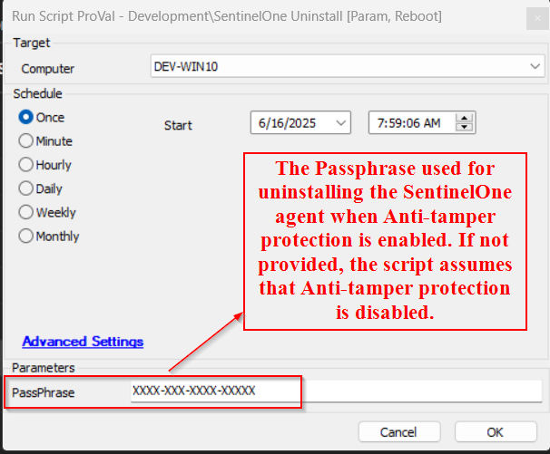
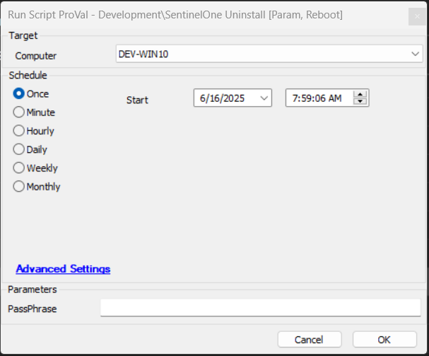

## Summary
This script uninstall the Sentinel using the agnostic "Remove-SentinelOne.ps1" script. If the script fails to remove SentinelOne, it will force a reboot when no user is logged in. And when a user is found to be logged in, it will enable the Reboot Flag.

## Sample Run

## User Parameters

| Name               | Example                                                         | Mandatory | Description                                                                                                                                                                                                                   |
|--------------------|-----------------------------------------------------------------|-----------|-------------------------------------------------------------------------------------------------------------------------------------------------------------------------------------------------------------------------------|
| PassPhrase               | xxxxxxxx-xxxx-xxxx-xxxxxxxx                | False      | Passphrase for disabling anti-tampering                                 |

## Ticketing

It is optional and gets enabled if the script called using monitor and the monitor gets the ticket category set to record the automation.

**Subject:** `SW - Sentinel Agent Uninstallation Failed on %computername%`

**Body:**  
`Failed to uninstall the Sentinel Agent. Refer to the logs: @ErrorLog@`

OR 

`Failed to execute the powershell script. A security application or Antivirus Programme seems to be restricting the script execution.`

## Output

- Script Logs
- Log file on the end machine
