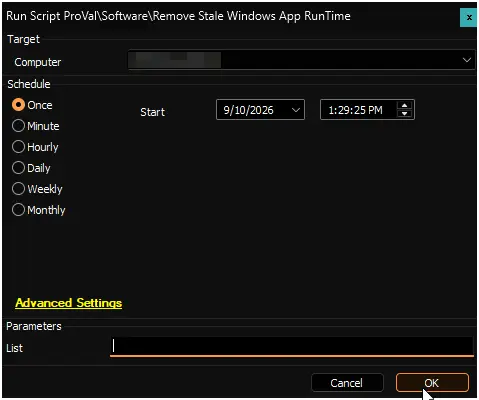

## Summary

The script audits the endpoint for superseded Windows App Runtime framework packages and removes them, keeping only the newest build of every package family and architecture. It uses the logic from the [Remove-StaleWindowsAppRunTime](/docs/c9b1d4f8-2a5e-4f9a-8b7c-6d3e1f9a2b4c) PowerShell script.

The script operates in two modes:

- **Reporting Mode (Detection):** When the `List` parameter is set to `1`, the script inventories the installed runtimes and reports which ones are superseded and removable, without making any changes. This is used by the remote monitor to trigger alerts.
- **Cleanup Mode (Remediation):** When the `List` parameter is omitted or `0`, the script actively removes the superseded packages for all users.

Winget is not used at any point. The script works entirely through the Appx cmdlets, which report the real MSIX build number rather than the marketing version Winget displays. Component-Based Servicing (CBS) packages are strictly excluded, as they are managed by Windows Update.

## Sample Run

**Regular Execution:**  

## Dependencies

- [PowerShell: Remove-StaleWindowsAppRunTime](/docs/c9b1d4f8-2a5e-4f9a-8b7c-6d3e1f9a2b4c)
- [Remote Monitor: Remove Stale Windows App RunTime](/docs/88cbf156-e4d4-4b3b-8929-bd5383781756)

## Global Variables

| Name | Value | Accepted Values | Description |
| ---- | ----- | --------------- | ----------- |
| Debug | `False` | `False`, `True` | When `True`, enables informational logging; when `False` (default), informational logs are suppressed to avoid adding entries to the `h_scripts` table. Set to `True` to assist with troubleshooting. |
| ScriptEngineEnableLogger | `False` | `False`, `True` | When `True`, enables final (success/failure) logging; when `False` (default), these logs are suppressed to avoid adding entries to the `h_scripts` table. Set to `True` to assist with troubleshooting. |

## User Parameters

| Name              | Example | Required                      | Description                                                                                          |
|-------------------|---------|-------------------------------|------------------------------------------------------------------------------------------------------|
| List              | 1       | False                         | Set to `1` to run in reporting mode. The script will output the installed Windows App Runtimes and whether they are removable, without actually removing anything. Leave empty or `0` to run in cleanup mode, which removes the superseded builds. |

## Notes

### Stale versus Removable

The script distinguishes between packages that are superseded (`Stale`) and packages that can actually be actioned (`Removable`).
When a framework package is deregistered for all users, its staged payload remains on disk in `C:\Program Files\WindowsApps` and cannot be removed by supported Windows APIs. Because these leftovers are inert and invisible to applications, the script marks them as `Stale` but not `Removable`.
**Important for monitors:** The associated remote monitor keys off the `Removable` state. If it keyed off `Stale`, it would trigger an infinite alert loop on the stranded leftovers.

### Safe Grouping

Grouping is performed by package family name and architecture, rather than just the package name.

- For the 1.x runtimes, the version number is part of the package family name (e.g., `Microsoft.WindowsAppRuntime.1.4` vs `1.8`). Windows treats them as separate components. Grouping by family guarantees the newest build of every family survives, ensuring applications compiled against older runtimes do not break.
- Architecture is included in the grouping so 32-bit and 64-bit builds are never mistaken for duplicates of each other.

### Excluded Packages

Packages matching `Microsoft.WindowsAppRuntime.CBS*` are filtered out at collection time. They are never reported, evaluated, or removed. CBS (Component-Based Servicing) packages are the copy of the runtime that ships inside Windows and is patched by Windows Update. They are not part of the accumulation problem caused by Winget/MSIX side-by-side installs.

## Output

- Script log
- Strapper log files (`Remove-StaleWindowsAppRunTime-log.txt`, `Remove-StaleWindowsAppRunTime-error.txt`)

## Changelog

### 2026-09-10

- Initial version of the document.
