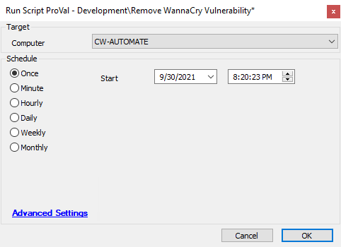

## Summary

The script will remove the WannaCry Solution provided by the ConnectWise Solution Center from the Automate environment.

**Time Saved by Automation:** 20 Minutes

## Sample Run

## Process

- Remove "Wannacrypt Microsoft Patches" script, if it exists.
- Remove "Patching/WannaCry Vulnerable" Group.
- Remove "Patching/WannaCry Vulnerable" Search.
- Remove "WannaCry/Petya Vulnerability Check" dataview.
- Remove the entry of the primary script from the `pendingscripts`, `runningscripts`, and `scheduledscripts` tables.
- Remove the primary script ("WannaCry Vulnerability Check").
- Refresh the Computer level EDFs.

## Output

Script Log

