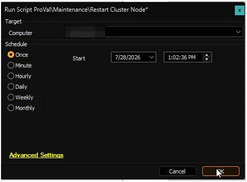

## Summary

This script safely restarts a single Hyper-V cluster node from within CW Automate, without causing downtime for the virtual machines (VMs) running on it.

When triggered, the script performs the following steps on the target node:

1. **Downloads and verifies** the restart script from our secure content repository. Every download is checked against our code-signing certificate before it runs, so only trusted, unmodified code is executed on your systems.

2. **Prepares the VMs for reboot.** Clustered (highly available) VMs are live-migrated to another healthy node in the cluster, so they stay online throughout the reboot. Non-clustered VMs, which cannot be migrated, are safely suspended (their state is saved to disk).

3. **Restarts the node.** Once every VM has been accounted for, the node reboots.

4. **Restores everything automatically.** After the node comes back online and rejoins the cluster, a built-in post-reboot task resumes the suspended VMs and migrates the clustered VMs back to this node. The task then removes itself, leaving no leftover artifacts.

**Built-in safety:** If anything goes wrong before the reboot (for example, a VM fails to migrate or suspend), the script automatically reverses all changes and cancels the reboot. The node is never left in a half-migrated state.

**Monitoring:** CW Automate monitors the post-reboot restore process and reports one of three statuses:

- **Success** -- All VMs have been restored to the node.
- **Continue** -- The restore is still in progress; no action is needed.
- **Failure** -- The restore did not complete; manual investigation is required. Details are included in the script output.

> **Note:** This script restarts one node at a time. To restart multiple nodes, run it on each node separately, allowing the first node to fully complete its restore before starting the next.

> **Prerequisite:** A one-time environment setup (Kerberos delegation in Active Directory and a per-host Hyper-V setting) must be completed before using this script for the first time. See the [Restart-ClusterNode](/docs/6d72e8de-7031-4d4d-81a8-f6c6ab3729e7) documentation for full setup instructions.

## Dependencies

- [Restart-ClusterNode](/docs/6d72e8de-7031-4d4d-81a8-f6c6ab3729e7)

## Sample Run

## Global Variables

| Name | Value | Accepted Values | Description |
| ---- | ----- | --------------- | ----------- |
| Debug | `False` | `False`, `True` | When `True`, enables informational logging; when `False` (default), informational logs are suppressed to avoid adding entries to the `h_scripts` table. Set to `True` to assist with troubleshooting. |
| ScriptEngineEnableLogger | `False` | `False`, `True` | When `True`, enables final (success/failure) logging; when `False` (default), these logs are suppressed to avoid adding entries to the `h_scripts` table. Set to `True` to assist with troubleshooting. |
| TimeoutMinutes | 30 | | |

## Output

- Script Logs

## Changelog

### 2026-07-28

- Initial version of the document.
