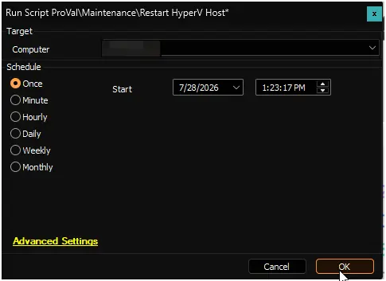

## Summary

This script safely restarts a standalone Hyper-V host from within CW Automate, while preserving the state of every virtual machine (VM) running on it.

When triggered, the script performs the following steps on the target host:

1. **Downloads and verifies** the restart script from our secure content repository. Every download is checked against our code-signing certificate before it runs, so only trusted, unmodified code is executed on your systems.

2. **Prepares the VMs for reboot.** All running VMs are safely suspended, meaning their current state is saved to disk. This is similar to hibernating a laptop: the VMs pause exactly where they are and pick up right where they left off after the reboot.

3. **Restarts the host.** Once every VM has been suspended and confirmed as saved, the host reboots.

4. **Restores everything automatically.** After the host comes back online, a built-in post-reboot task waits for the Hyper-V service to start, then resumes each VM from its saved state. The task then removes itself, leaving no leftover artifacts.

**Built-in safety:** If any VM fails to suspend before the reboot, the script automatically resumes all VMs that were already suspended and cancels the reboot. The host is never left in a partially suspended state.

**Monitoring:** CW Automate monitors the post-reboot restore process and reports one of three statuses:

- **Success** -- All VMs have been resumed on the host.
- **Continue** -- The restore is still in progress; no action is needed.
- **Failure** -- The restore did not complete; manual investigation is required. Details are included in the script output.

> **Note:** This script is designed for standalone Hyper-V hosts that are not part of a failover cluster. For clustered environments, use the `Restart Cluster Node` script instead, which live-migrates clustered VMs to a neighbor node so they remain online during the reboot.

> **Note:** Because VMs are suspended rather than live-migrated, there is a brief period during the reboot window when the VMs are paused. Workloads inside the VMs will experience this as a short interruption, similar to a host going into and coming out of hibernation.

## Dependencies

- [Restart-HyperVHost](/docs/6da0235c-ed6e-4a81-b085-411337706b36)

## Sample Run

## Global Variables

| Name | Value | Accepted Values | Description |
| ---- | ----- | --------------- | ----------- |
| Debug | `False` | `False`, `True` | When `True`, enables informational logging; when `False` (default), informational logs are suppressed to avoid adding entries to the `h_scripts` table. Set to `True` to assist with troubleshooting. |
| ScriptEngineEnableLogger | `False` | `False`, `True` | When `True`, enables final (success/failure) logging; when `False` (default), these logs are suppressed to avoid adding entries to the `h_scripts` table. Set to `True` to assist with troubleshooting. |
| TimeoutMinutes | 30 | Any positive integer | The maximum number of minutes CW Automate will wait for the post-reboot restore process to complete before reporting a failure. If the VMs have not been fully resumed within this window, the monitor flags the host for manual investigation. Increase this value for hosts with a large number of VMs or slower storage, where the resume process may take longer. |

## Output

- Script Logs

## Changelog

### 2026-07-29

- Initial version of the document.
