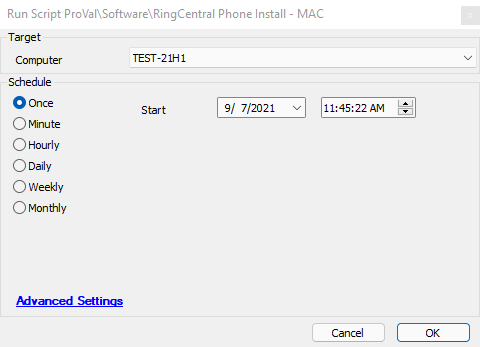

## Summary

This script attempts to unpack and install the RingCentral Phone application on an OSX (Mac) device.

**Time Saved by Automation:** 5 Minutes

## Sample Run

**Note:** This script will only run on OSX machines. If this script is not working, please notify ProVal at [support@provaltech.com](mailto:support@provaltech.com).

## Dependencies

The web-based link is hardcoded into line 4 of the script. This URL may need to be updated for future versions.

## Variables

`@MountedName@` - The name of the application when it is mounted on the Unix OS.

## Process

The script will put the machine into Fast Talk mode, as this makes the script run more efficiently on Mac machines. The script will download the RingCentral Phone application, mount the DMG file, and retrieve the name of the application to be installed. It will then issue a command to copy the proper file to the Applications folder, effectively installing the application. Once the application is copied, the script will unmount the DMG file and verify that the software was installed. If the software was installed successfully, the script will exit with a success log message. If the software was not installed, the script will exit with a failure log message.

## Output

Script log messages

