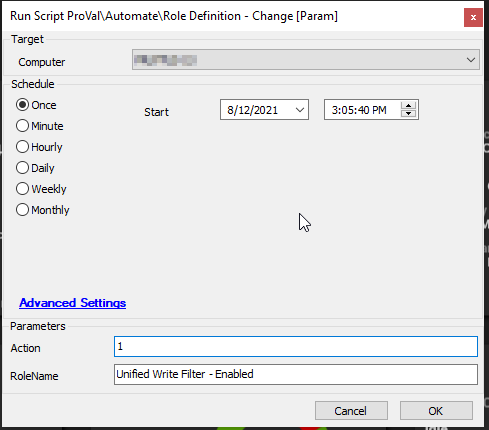

## Summary

This script helps to either apply or ignore an existing role in your environment.

This way, the monitor that depends on a role to detect machines and perform actions can be controlled. This will help avoid modifications to group monitors, overrides, and alert action changes; it simply forcefully sets roles to ignore/apply on the agent.

**Time Saved by Automation:** 5 Minutes

## Sample Run

## Dependencies

- Windows OS

## Variables

- **RoleName** - Set as a user parameter at script execution time
- **Action** - Set as a user parameter at script execution time
- **Output** - Confirms parameters were set correctly; will exit the script on error
- **RoleCheck** - Confirms the script executed properly; will exit the script on error

#### User Parameters

| Name      | Example                           | Required | Description                                                                 |
|-----------|-----------------------------------|----------|-----------------------------------------------------------------------------|
| RoleName  | Unified Write Filter - Enabled     | True     | Copy and paste the exact name of the role definitions for the script to work |
| Action    | 1                                 | True     | Integer value of 1 or 2 (1 = Apply, 2 = Ignore)                           |

## Process

The script executes a PowerShell command to confirm parameters are set correctly.

An SQL query is executed against the Automate DB to apply or ignore the role on the agent system. Role changes are confirmed, and the script exits successfully or on failure.

## Output

- **Script Log Message**
  
- **Success** - Changes applied for the specified role name
  
- **Role Missing** - Role name not provided in parameters
  
- **Action Missing** - Action not provided in parameters
  
- **Exit with Error** - Script failed to execute properly

