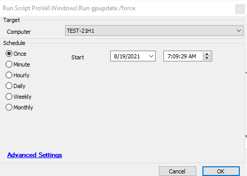

## Summary

This script runs `gpupdate /force` on the target Windows machine.

**Time Saved by Automation:** 5 Minutes

## Sample Run

## Process

This script runs `gpupdate /force` on the target Windows machine.

## Output

- Script log

