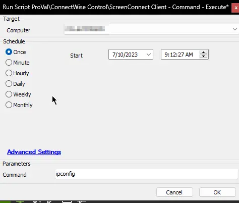

## Summary

This script will execute a command via the default command-line parser on the target agent through Control.

**Time Saved by Automation:** 10 Minutes

## Sample Run

## Dependencies

[CW RMM+ Plugin Configuration](/docs/f99ddaae-0cb3-4941-b2aa-dc93671dd246)

#### User Parameters

| Name     | Example     | Required | Description                                             |
|----------|-------------|----------|---------------------------------------------------------|
| command  | net user    | False    | This is the command that will run through Control.     |

#### System Properties

| Name                  | Example                           | Required | Description                                                                                                      |
|-----------------------|-----------------------------------|----------|------------------------------------------------------------------------------------------------------------------|
| RMMPlus_AccessKey     | dd22rtbm!sde8ye                  | True     | This is the key set up in the CW Control RMM+ Plugin so Automate can reach out to gain access to the API.       |
| RMMPlus_Headers       | origin: [yours.control.com](http://yours.control.com) | True     | This is the URL (without http/https) for the CW Control server. This value needs to match the value in the RMM+ Plugin configuration in CW Control. |
| RMMPlus_Timeout       | 1000                              | True     | The default timeout for command runs via RMM+ through Automate. 1000 is the default.                          |

## Output

- Script log