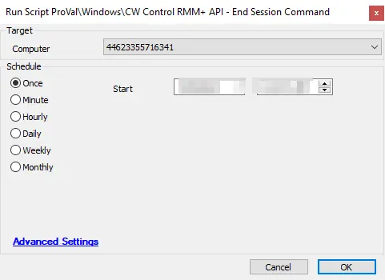

## Summary

This script will attempt to end a matching session in the CW Control portal using the provided GUID.

**Time Saved by Automation:** 5 Minutes

## Sample Run

**Target:** Any machine with CW Control installed

## Dependencies

- RMM+ extension in CW Control
- HTTP GET/POST Plugin in CW Automate
- System properties

**Note:** This script is a subscript of [CW Control - Uninstall and Remove from Control Web Portal](/docs/d69c20e1-e605-4cf9-bf35-bbe4c74f134f)

### Variables

- `@accesskey@` - See System properties below
- `@httpplugin_headers@` - See System properties below
- `@sccomputerguid@` - The GUID of the CW Control instance
- `@SCUrl@` - The URL for the CW Control portal
- `@Port@` - The port in use for CW Control
- `@SCFormattedURL@` - A formatted URL to work properly with the RMM+ extension in CW Control
- `@SCCommandURL@` - The URL to end sessions related to the RMM+ Plugin
- `@wiperesult@` - The output of the results from the command run above.

### System Properties

| Name                         | Example                               | Required | Description                                                                                                   |
|------------------------------|---------------------------------------|----------|---------------------------------------------------------------------------------------------------------------|
| RMMPlus_AccessKey           | ajw8fh2p93ufn;o31ifu2091j23oif      | True     | This is the key set up in the CW Control RMM+ Plugin so Automate can reach out to gain access to the API.    |
| RMMPlus_Headers             | Origin: [site.site.com](http://site.site.com/) | True     | This is the URL (without http/https) for the CW Control server. This value needs to match the value in the RMM+ Plugin configuration in CW Control. |
| RMMPlus_StaleAgentThreshold  | 30                                    | True     | The number of days to indicate what a "stale" agent is to the scripts. 30 is the default.                   |
| RMMPlus_Timeout             | 1000                                  | True     | The default timeout for commands run via RMM+ through Automate. 1000 is the default.                       |

## Process

This script will populate several variables required for RMM+ to function properly. The script will then post the command using the HTTP GET/POST plugin to remove the agent from the CW Control portal. The script will log the results.

## Output

**Script log messages only**