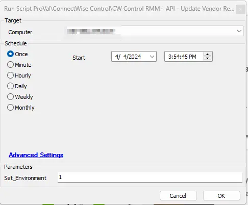

## Summary

This script is a duplicate of [Script - ScreenConnect - Update Custom Property* [RMM+,Param]](/docs/b634da09-7507-466f-be5e-f7a8d62aacf7), which has been specifically designed to set the "`Vendor Restricted`" custom property in the CW Control Portal. It will set the custom property value to "`Restricted`" to restrict the machine to the vendor and "`Unrestricted`" to remove its restriction.

The system property `PropertyIndex` needs to be set before running the script.

## Sample Run

**Target:** Any machine with CW Control installed for setting up the properties.

## Dependencies

- [CWM - Automate - RMM+ Plugin Configuration](/docs/f99ddaae-0cb3-4941-b2aa-dc93671dd246)
- [Restrict Vendor Access to Clients](/docs/48cd317b-4188-4881-b9c3-411cd0323508)
- [CWM - Automate - Internal Monitor - Automatically Restrict Vendor Machines in SC](/docs/4a4b5a11-8087-4e0a-b2b1-629d07326dd2)

#### Variables

| Name                | Description                                                                                                                                                                                                                  |
|---------------------|------------------------------------------------------------------------------------------------------------------------------------------------------------------------------------------------------------------------------|
| `sccomputerguid`    | The GUID of the CW Control instance                                                                                                                                                                                        |
| `SCUrl`             | The URL for the CW Control portal                                                                                                                                                                                          |
| `Port`              | The port in use for CW Control                                                                                                                                                                                              |
| `SCFormattedURL`    | A formatted URL to work properly with the RMM+ extension in CW Control                                                                                                                                                     |
| `SCCommandURL`      | The URL to end sessions related to the RMM+ Plugin                                                                                                                                                                         |
| `pluginresult`      | The output of the results from the command run above.                                                                                                                                                                      |
| `PropertyValue`     | PropertyValue will be automatically fetched based on the "`Restrict Vendor Access`" EDF's value. If EDFs are selected and the machine is not restricted in ScreenConnect, it will automatically restrict it. Similarly, if any machine is accidentally set to restricted and EDFs are not selected at the client or location level, it will automatically revert the changes for that machine. |

## User Parameters

| Name                    | Example | Required                              | Description                                                                                                                                                                                                                  |
|-------------------------|---------|---------------------------------------|------------------------------------------------------------------------------------------------------------------------------------------------------------------------------------------------------------------------------|
| `Set_Environment`       | 1       | True (for first time run only)       | Set its value to '1' to create "`Restrict Vendor Access`" EDFs, "`PropertyIndex`" System Properties, "`Vendor Restricted - Super Admin`" user class, "`Restricted Vendor Access`" search, and "`Restrict Vendor Access`" group. These are all required for [Restrict Vendor Access to Clients](/docs/48cd317b-4188-4881-b9c3-411cd0323508). |
| `Set_Client_Permissions` | 1       | True (for first time after creating the `Super Admin - Restricted Vendor Access` user class) | Set its value to '1' in order to add `Super Admin - Restricted Vendor Access` full permissions to the selected client.                                                                                                       |

## System Properties

| Name                           | Example                             | Required | Description                                                                                                                                                                                                                  |
|--------------------------------|-------------------------------------|----------|------------------------------------------------------------------------------------------------------------------------------------------------------------------------------------------------------------------------------|
| `RMMPlus_AccessKey`           | ajw8fh2p93ufn;o31ifu2091j23oif     | True     | This is the key set up in the CW Control RMM+ Plugin so Automate can reach out to gain access to the API.                                                                                                                |
| `RMMPlus_Headers`             | Origin: [site.site.com](http://site.site.com/) | True     | This is the URL (without http/https) for the CW Control server. This value needs to match the value in the RMM+ Plugin configuration in CW Control.                                                                        |
| `RMMPlus_StaleAgentThreshold`  | 30                                  | True     | The number of days to indicate what a "stale" agent is to the scripts. 30 is the default.                                                                                                                                 |
| `RMMPlus_Timeout`             | 1000                                | True     | The default timeout for commands run via RMM+ through Automate. 1000 is the default.                                                                                                                                     |
| `PropertyIndex`               | 5                                   | True     | This is the custom property in CW Control that you want to set. Properties 1-4 are used by the CWA/CWC plugin. It is suggested to start with Properties 5-8. This video can explain how to set them up in CWC. [Watch here](https://www.youtube.com/watch?v=KgtLfEkAdwM) |

## Output

Script log messages only.