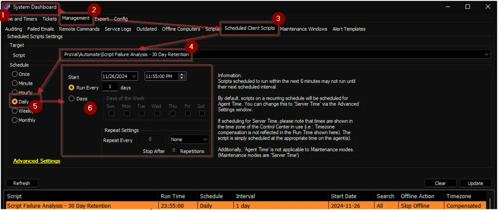

## Summary

The purpose of this script is to create the [pvl_Script_Assessment](/docs/31e58aae-ce62-4440-8319-b22abec4e842) table, populate data into it, and remove any data older than 30 days from the table.

## Update Notice: 29-November-2024

**Changes:**
- The script has been renamed from `Script Failure Analysis - 30 Day Retention` to `Weekly Script Failure Analysis - 30 Day Retention`.
- The logic has been converted from weekly to daily data updates for better accuracy.

**Update Instructions:**
- Update/import this script from the `Prosync` plugin.
- Navigate to `System` > `Configuration` > `Dashboard` > `Management` > `Scheduled Client Script`.
- Remove the schedule for the `Weekly Script Failure Analysis - 30 Day Retention` script.
- Schedule the `Script Failure Analysis - 30 Day Retention` to run once per day, preferably around midnight, as demonstrated in the `Sample Run` section of the document.

## Sample Run

Schedule the script to run once per day, preferably around midnight.  

