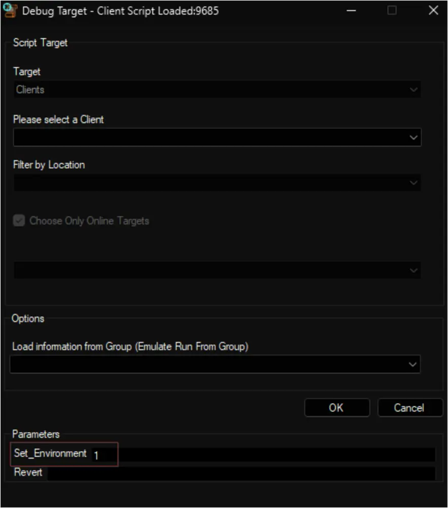
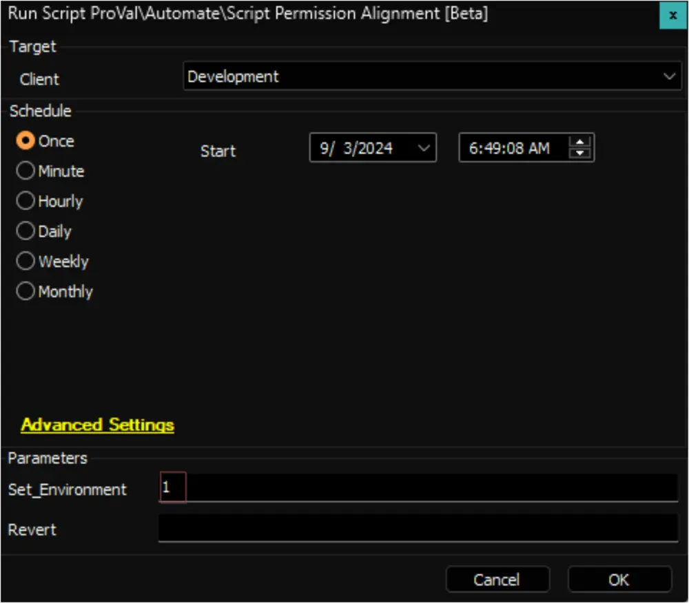
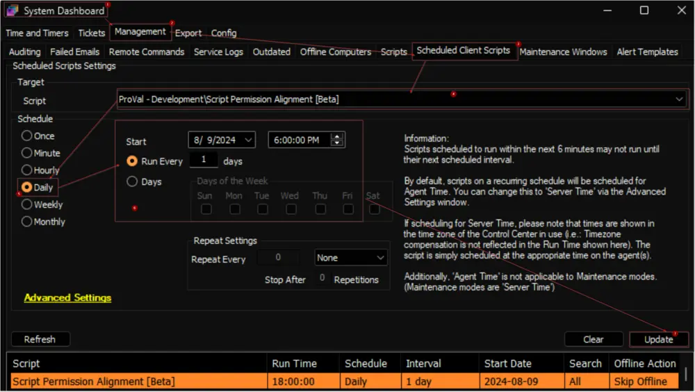
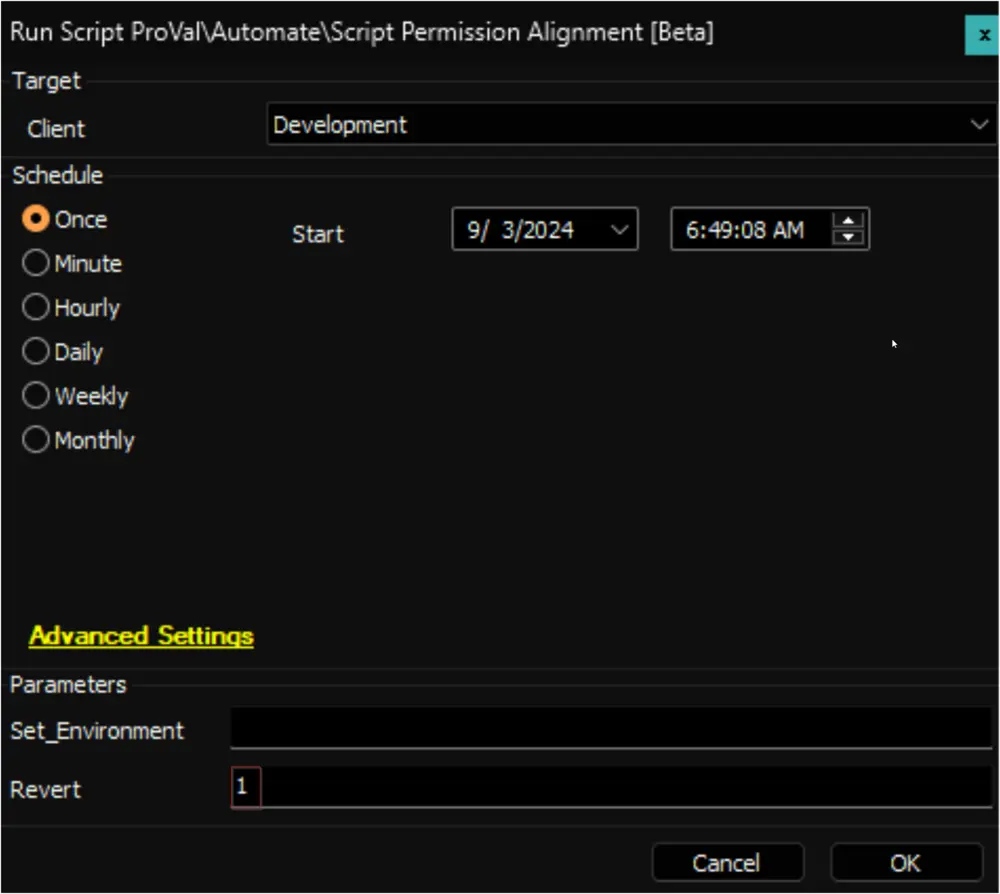
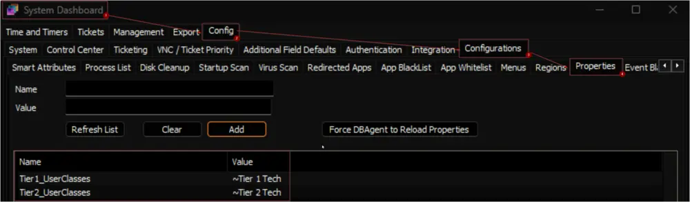
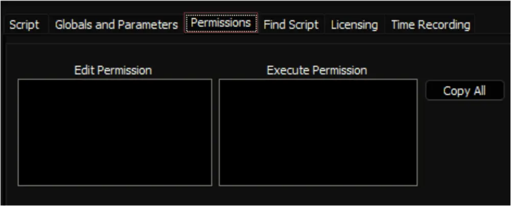

## Summary

The script is designed to standardize the permissions of the Built-In scripts in ConnectWise Automate. Access to the stock scripts is manually defined in the [pvl_scripts_permissions](/docs/22dabcfc-b55c-4eae-81df-96c01446c3b7) custom table. The script then sets the permissions of each script according to the access set in the table.

**Permission Assignment:**
- Tier 1 Techs get access to Tier 1 scripts.
- Tier 2 Techs get access to Tier 1 and Tier 2 scripts.
- Tier 3 (Super Admin) gains access to Tier 1, Tier 2, Super Admin, and Nobody scripts.

## Sample Run

**First Execution:** Debug or run the script against any client with the `Set_Environment` parameter set to `1`. This will create the system properties and the custom table used by the solution, and it will also insert the data into the custom table.

Apart from this, two ProVal-defined user classes, `~Tier 1 Tech` and `~Tier 2 Tech`, will be imported.

## Schedule

It is suggested to schedule the script to run once per day.

## Revert

The initial permissions of the scripts are stored in the custom table during the first execution of the script with the `Set_Environment` variable. By running the script against any client with the `Revert` parameter set to `1`, the permissions of the scripts will be restored to the original.

## Dependencies

[CWM - Automate - Custom Table - pvl_scripts_permissions](/docs/22dabcfc-b55c-4eae-81df-96c01446c3b7)

## User Parameters

| Name              | Example | Required        | Description                                                                                                                                                                                                                                                                               |
|-------------------|---------|------------------|-------------------------------------------------------------------------------------------------------------------------------------------------------------------------------------------------------------------------------------------------------------------------------------------|
| Set_Environment    | 1       | First Execution   | Debug or run the script against any client with the `Set_Environment` parameter set to `1`. This will create the system properties and the custom table used by the solution and insert the data into the custom table. Apart from this, the two ProVal-defined user classes `~Tier 1 Tech` and `~Tier 2 Tech` will also be imported. |
| Revert            | 1       | False            | To restore the permissions. The initial permissions of the scripts are stored in the custom table during the first execution of the script with the `Set_Environment` variable. By running the script against any client with the `Revert` parameter set to `1`, the permissions of the scripts will be restored to the original. |

## System Properties

| Name              | Example                   | Required | Description                                                                                                     |
|-------------------|---------------------------|----------|-----------------------------------------------------------------------------------------------------------------|
| Tier1_UserClasses | ~Tier 1 Tech, Admin      | True     | Comma-separated list of the Tier 1 User Classes. Default Value: `~Tier 1 Tech`                              |
| Tier2_UserClasses | ~Tier 2 Tech, NocUsers    | True     | Comma-separated list of the Tier 2 User Classes. Default Value: `~Tier 2 Tech`                              |

## Output

- Custom Table
- Script-level permissions  
