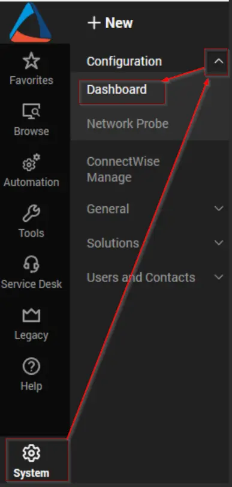
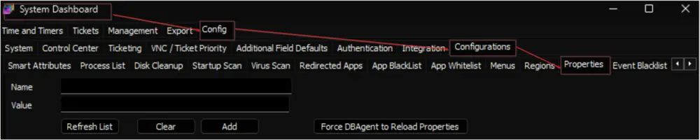
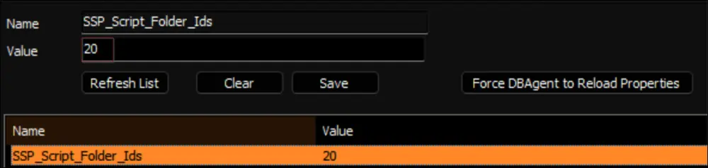

## Summary

The script is designed to manage view and edit permissions for scripts within specific script folders. It relies on system properties to determine folder IDs, user classes for view permissions, and user classes for edit permissions.

- The folder IDs of the scripts are expected to be stored in the `SSP_Script_Folder_Ids` system property.
- User classes designated for view permissions should be specified in the `SSP_View_Permission_User_Classes` system property.
- User classes designated for edit permissions should be specified in the `SSP_Edit_Permission_User_Classes` system property.

Importantly, if the `SSP_Script_Folder_Ids` property is missing or not set, the script will not execute any changes.

Furthermore, if the system properties for user classes regarding view and edit permissions are not set, the script will default to granting both edit and view permissions to the `Super Admin` user class.

In essence, this script ensures proper management of permissions for scripts within designated folders, ensuring security and access control based on the system properties.

**Note:** Prior to proceeding, kindly obtain the name(s) of the script folder(s) and the user class(es) from the consultant.

## Show the Folder IDs of Script Folders

1. Navigate to `Preferences`  
   

2. Enable the `Show` option for `Object IDs` and click the `SAVE` button to apply and save the preferences.  
   

## Find the Folder IDs of Script Folders

3. Navigate to Automation > Scripts > View Scripts.  
   

4. Navigate to the search field located on the left-hand side of the screen and search for the name(s) of the script folder(s). As an example, you can search for the `_Automation` folder. The number displayed within parentheses alongside the folder name represents the folder's ID.  
   

## Find the Name of the User Classes

1. Navigate to System > User and Contacts > User Class Manager to access the `User Class Manager`.  
   

2. Retrieve the name(s) of the user class(es) from the `User Class Manager` to which the script permissions will be restricted.

## Implementation

1. Import the [Script Permissions - Set [Properties]](/docs/f4a08fe7-fb91-4bfb-9650-fb8da3ebd5b2) script from the `ProSync` plugin.

2. Execute the script against any client with the `Set_Environment` parameter set to `1` to create the associated system properties.  
   

3. Reload the System Cache.  
   

4. Navigate to System > Configuration > Dashboard > Config > Configurations > Properties.  
     
   

5. Locate the `SSP_Script_Folder_Ids` system property and set the ID(s) of the desired script folder(s).  
     
   Multiple IDs can be set by separating them with a comma without any spaces between them.  
   

6. Locate the `SSP_View_Permission_User_Classes` system property and set the name(s) of the User Class(es) that require view permissions for the scripts.  
     
   Multiple User Class names can be set by separating them with a comma without any spaces between them.  
   

7. Locate the `SSP_Edit_Permission_User_Classes` system property and set the name(s) of the User Class(es) that require edit permissions for the scripts.  
     
   Multiple User Class names can be set by separating them with a comma without any spaces between them.  
   

8. Navigate to Management > Scheduled Client Scripts inside the `Dashboard` and schedule the script to run once per hour.  
   

## System Properties

| Name                          | Default      | Required | Description                                                                                               |
|-------------------------------|--------------|----------|-----------------------------------------------------------------------------------------------------------|
| `SSP_Script_Folder_Ids`       | 0            | True     | Stores the IDs of the Script Folder(s) of the scripts for which script permissions need to be restricted. |
| `SSP_View_Permission_User_Classes` | Super Admin | True     | Stores the name(s) of the User Class(es) that require view permissions for the scripts.                  |
| `SSP_Edit_Permission_User_Classes` | Super Admin | True     | Stores the name(s) of the User Class(es) that require edit permissions for the scripts.                  |
