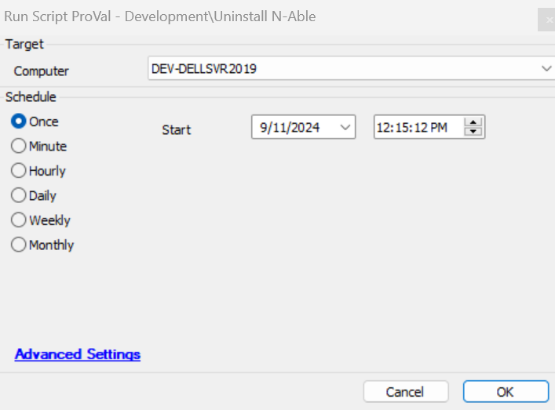

## Summary

This script performs the uninstallation of the N-Able (Windows Agent) application and deletes all its traces.

## Sample Run

## Dependencies

[Uninstall-N-Able](/docs/a6048dd1-3c62-4607-86db-d74826c89109)

## Variables

| Name             | Description                                                                                                                                                      |
|------------------|------------------------------------------------------------------------------------------------------------------------------------------------------------------|
| ProjectName      | This contains the agnostic PowerShell script name and sets it as a project, with the working directory at `C:/ProgramData/_Automation/Script/@ProjectName@`. |
| WorkingDirectory  | This is the directory where the agnostic script downloads and its logs are stored. The directory path is `C:/ProgramData/_Automation/Script/@ProjectName@`.   |
| PS1Log           | This stores the PowerShell informational logs for validation and saves them in the `@WorkingDirectory@` folder with the name: `@ProjectName@-log.txt`.        |
| PS1ErrorLog      | This contains the PowerShell error logs for validation and saves them in the `@WorkingDirectory@` folder with the name: `@ProjectName@-error.txt`.           |
| ErrorLog         | This contains the content of the error log file, i.e., `@ProjectName@-error.txt`.                                                                             |

## Output

- Script log
- Local file on the computer
