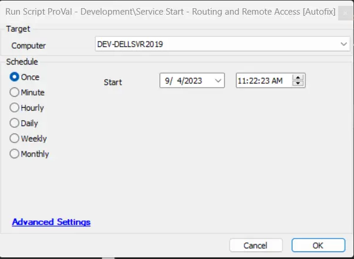

## Summary

This document describes how to set the startup type to Automatic and restart the RemoteAccess service on endpoints.

### Alert Template

- Autofix - Set RemoteAccess Startup Type to Auto

This should be called by the monitor [CWM - Automate - Remote Monitor - ProVal - Development - RemoteAccess Service - Set StartType To Auto](/docs/487873f8-4b59-47bc-b938-c64903898d8a).

## Sample Run

## Output

- Startup Type: Automatic  
- Status: Running