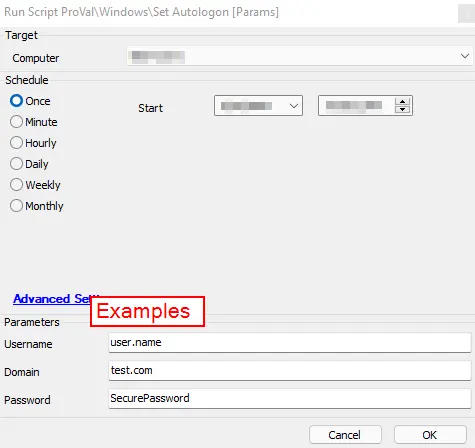

## Summary

This script downloads Autologon.exe from the Sysinternals website and passes the Autologon.exe parameters that allow a user to log in automatically after the system is rebooted.

**Time Saved by Automation:** 15 Minutes

## Sample Run

## Dependencies

This script downloads a file from the Microsoft Sysinternals website. If this link changes, the script must be updated to reflect the proper download location.

### User Parameters

| Name     | Example           | Required | Description                                                                                      |
|----------|-------------------|----------|--------------------------------------------------------------------------------------------------|
| Username | user.name         | True     | The username of the user for Autologon on the target device.                                   |
| Domain   | test.com          | False    | The name of the domain. (Leave blank for a local user account.)                                |
| Password | SecurePassword1    | True     | The password for the user for Autologon on the target device.                                   |

## Process

This script downloads Autologon.exe from Microsoft to the LTSvc folder. It then executes the Autologon.exe application, passing the parameters entered by the user running the script. The script will subsequently lock the machine, forcing the Autologon to take effect.

## Output

- Script log messages
