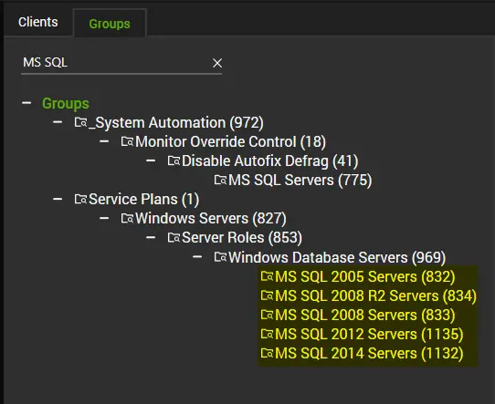
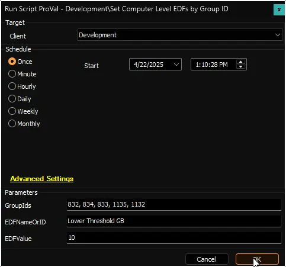
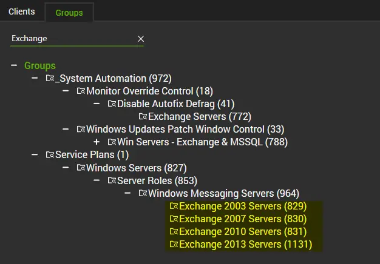
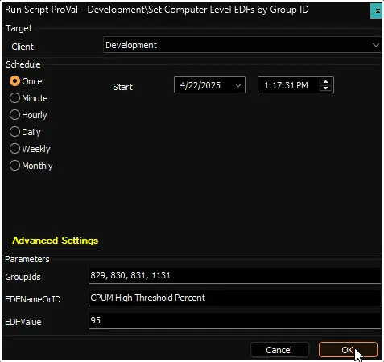
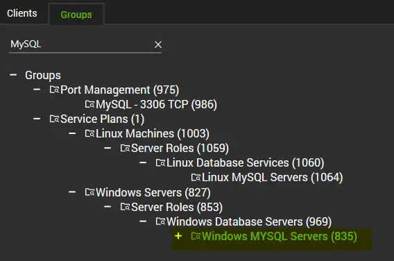
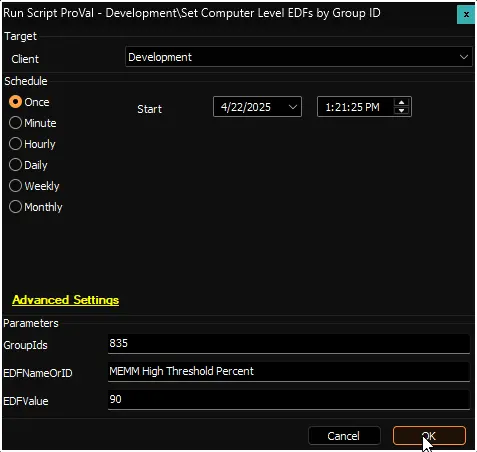

## Summary

The script offers a faster and more convenient way to assign values to an EDF for multiple computers using group IDs.

## Sample Run

### Example 1

Updating the critical drive space monitoring threshold for all `MS SQL Servers`.
**EDF:** `Lower Threshold GB`  
*The above mentioned EDF belongs to the [Critical Drive Space Monitor Creation](/docs/80abd1fa-a278-4e08-a6aa-0dc8840ad103) script.*

**Step 1**  
Gather the ids of `MS SQL Server` groups.  
**GroupIds:** `832, 834, 833, 1135, 1132`

**Step 2**  
Run the script against any client with appropriate arguments.  

### Example 2

Updating the detection threshold of high CPU usage monitoring for `Exchange Servers`.
**EDF:** `CPUM High Threshold Percent`  
*The above mentioned EDF belongs to the [CPU Threshold Violation Monitor - Create](/docs/20b0f192-7315-42d9-a575-9e088c15d79c) script.*

**Step 1**  
Gather the ids of `Exchange Server` groups.  
**GroupIds:** `829, 830, 831, 1131`

**Step 2**  
Run the script against any client with appropriate arguments.  

### Example 3

Updating the detection threshold of high Memory usage monitoring for `MySQL Servers`.
**EDF:** `MEMM High Threshold Percent`  
*The above mentioned EDF belongs to the [Memory Threshold Violation Monitor - Create](/docs/28530e35-7416-48c4-b56d-897c7d4727f6) script.*

**Step 1**  
Gather the ids of `MySQL Server` groups.  
**GroupIds:** `835`

**Step 2**  
Run the script against any client with appropriate arguments.  

## User Parameters

| Name         | Example               | Required | Description                                                                                     |
|--------------|-----------------------|----------|-------------------------------------------------------------------------------------------------|
| GroupIds     | `829, 830, 831, 1131` | True     | Comma-separated list of Group IDs for the machines where the EDF should be set.                |
| EDFNameOrID  | `MEMM High Threshold Percent` | True     | The exact name or ID of the EDF to be updated.                                                 |
| EDFValue     | `75`                  | False    | The value to assign to the EDF. Leave blank to reset the EDF. Use `1` or `0` for checkbox-type EDFs to flag or unflag. |

## Output

- Extra Data Fields