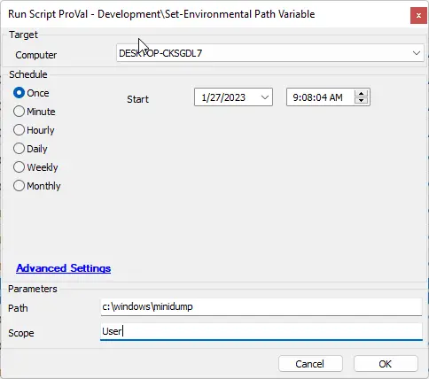
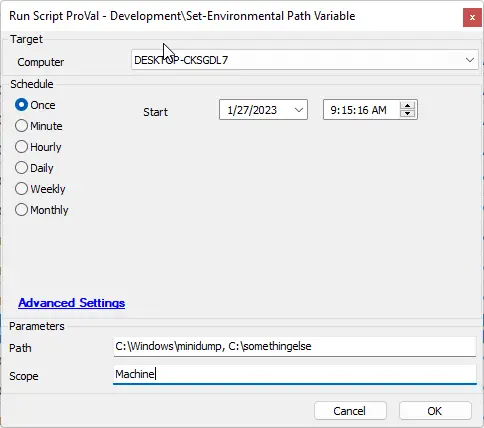

## Summary

This document will guide you through the process of adding a requested Windows path to the environmental path variable for the desired scope.

## Sample Run

- Setting a user-scoped path variable

- Setting more than one machine-scoped path variable.

**NOTE:** The scope is not mandatory; if left blank, the scope will default to the machine-scoped variable.

## Dependencies

- [Set-PathVariable](/docs/f91caf21-f00c-4459-8b1f-634720a92f4b)

## Variables

Standard agnostic template variables apply.

## User Parameters

| Name  | Example                   | Required | Description                                                                                     |
|-------|---------------------------|----------|-------------------------------------------------------------------------------------------------|
| Path  | C:/windows, C:/temp...   | True     | The paths that must exist in the scoped environmental path variable.                           |
| Scope | UserMachine               | False    | The scope of the environmental path variable you wish to target. This defaults to 'Machine'.   |

## Process

Please reference [Set-PathVariable](/docs/f91caf21-f00c-4459-8b1f-634720a92f4b) for process information.

## Output

- Script log