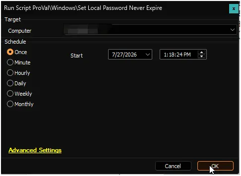

## Summary

This is the CW Automate implementation script for **[Set-LocalPasswordNeverExpire](/docs/d88e1dfe-3dbc-44bb-a08d-b8ea9839d08f)**. It acts as a secure delivery wrapper: rather than containing the account-modification logic itself, it retrieves the payload script from the content repository, verifies its integrity, and then executes it on the target machine.

Before any execution takes place, the script performs two rounds of Authenticode signature validation — first on itself, then on the downloaded payload. If either check fails (missing signature, unrecognised certificate, or absent timestamp), execution is blocked entirely. All downloads are conducted over TLS 1.2 or higher.

Once validated, the payload runs in the current elevated session and enables the Password never expires setting on every local user account. See the [Set-LocalPasswordNeverExpire](/docs/d88e1dfe-3dbc-44bb-a08d-b8ea9839d08f) document for full details on what the payload does.

If the content repository is unreachable, the script falls back to a previously cached copy of the payload (if one exists locally) and still enforces signature validation before running it. If no cached copy is available, the script exits with an error.

## Dependencies

- [Set-LocalPasswordNeverExpire](/docs/d88e1dfe-3dbc-44bb-a08d-b8ea9839d08f)

## Sample Run

## Global Variables

| Name | Value | Accepted Values | Description |
| ---- | ----- | --------------- | ----------- |
| Debug | `False` | `False`, `True` | When `True`, enables informational logging; when `False` (default), informational logs are suppressed to avoid adding entries to the `h_scripts` table. Set to `True` to assist with troubleshooting. |
| ScriptEngineEnableLogger | `False` | `False`, `True` | When `True`, enables final (success/failure) logging; when `False` (default), these logs are suppressed to avoid adding entries to the `h_scripts` table. Set to `True` to assist with troubleshooting. |

## Output

- Script Logs

## Changelog

### 2026-07-28

- Initial version of the document.
