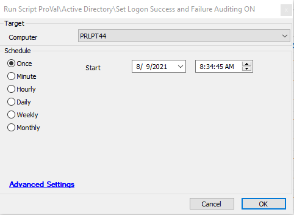

## Summary

This script uses `auditpol.exe` to configure logon auditing for success and failure events to ON. This applies to the default domain controller policy, so it will only run on a DC.

**Time Saved by Automation:** 5 Minutes

## Sample Run

## Variables

- `%Shellresult%` - Used to check whether the Auditpol command succeeded or not.

## Process

- The script checks if it's running on a DC; it exits if the machine is not a DC.
- It runs `Auditpol.exe /set /subcategory:logon /success:enable /failure:enable` to enable logon success and failure events.
- It checks whether the command succeeded or not.
- It resends the inventory command.

## Output

- Script log

