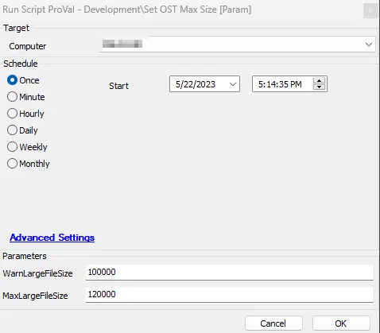

## Summary

This script helps to set each user's registry `Software/Microsoft/Office/OfficeVersion/Outlook/PST`: `MaxLargeFileSize` and `WarnLargeFileSize` to custom values as per user parameters or, by default, it sets `MaxLargeFileSize` to 100,000 MB and `WarnLargeFileSize` to 95,000 MB.

## Sample Run

## Dependency

Strapper Module

### User Parameters

| Name                | Example  | Required | Description                                                                                          |
|---------------------|----------|----------|------------------------------------------------------------------------------------------------------|
| MaxLargeFileSize    | 100000   | False    | If a value is set, then it will set the size in MB; if left empty, the default user registry is set to 100,000. |
| WarnLargeFileSize   | 120000   | False    | If a value is set, then it will set the size in MB; if left empty, the default user registry is set to 95,000.  |

## Output

- Script log