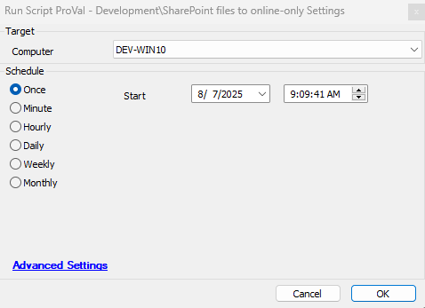

## Summary

This script sets the SharePoint files to online-only settings at the system and user level.

## File Hash

**File Path:** `C:\ProgramData\_automation\Script\SharePoint-OnlineOnly\SharePoint-OnlineOnly.ps1`  
**File Hash (Sha256):** `4DA1059C81270FF5313B7BF8A1B77B6E050580E1BA728487D98BA681794A6665`  
**File Hash (MD5):** `B2D07ECCA515DF825278B6A38EAB2D6E`  

## Sample Run

## Output

- Script log
- Local file: `C:\ProgramData\_Automation\Script\SharePoint-OnlineOnly\SharePoint-OnlineOnly-log.txt`
