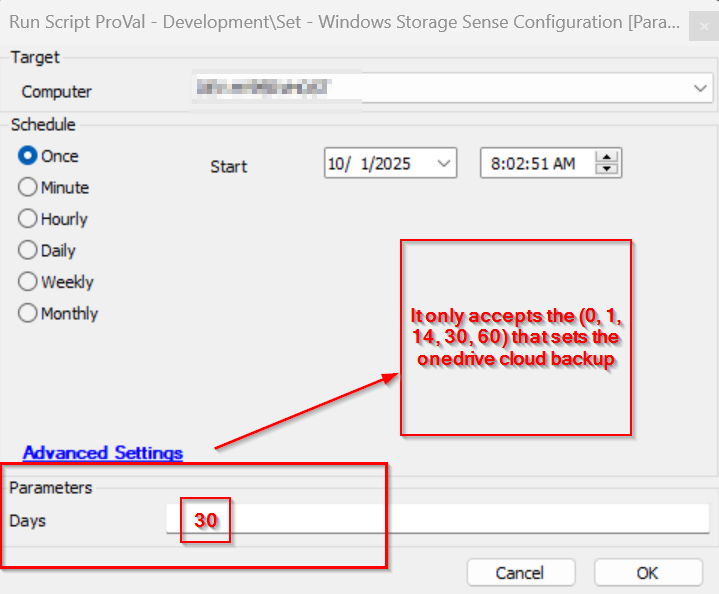

## Summary
This PowerShell script automates the configuration of user-level OneDrive Storage Sense settings in Windows by updating specific registry keys. It ensures the environment is properly prepared by setting up the required PowerShell repository and module (Strapper) and then modifies the registry to reflect the desired retention period for cloud-backed content.
This is particularly useful in enterprise environments where OneDrive cleanup policies need to be enforced consistently across user profiles.

## Sample Run

## Dependencies

The machine must be a Windows-based device; otherwise, the script will fail.

## User Parameter
- `Days`: The number of days to set the OneDrive cloud backup. It only accepts 0, 1, 14, 30, and 60 as days.

## Process

### Environment Setup:

- Configures PowerShell preferences.
- Ensures PSGallery is trusted and accessible.
- Installs or updates the Strapper module.

### Registry Update:

- Validates the input $Days against allowed values.
- Retrieves OneDrive-related registry keys under the Storage Sense policy path.
- Updates the 128 registry value for each OneDrive key to reflect the specified $Days.

### Error Handling:

- Catches and reports errors during repository setup, module installation, and registry access.

## Output

Location of output for log, result, and error files.

    - .\Update-OneDriveStoragePolicy-log.txt
    - .\Update-OneDriveStoragePolicy-data.txt
    - .\Update-OneDriveStoragePolicy-error.txt
    - Script log