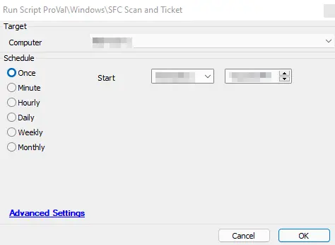

## Summary

This script performs an SFC scan on the target Windows device and creates a ticket if the SFC scan returns any errors.

**Time Saved by Automation:** 5 Minutes

**Note:** This is a maintenance-flagged script and is allowed to run while machines are in Maintenance Mode!

## Sample Run

## Dependencies

The machine must be a Windows-based device; otherwise, the script will fail.

## Variables

- `@psout@` - The result from the PowerShell Script
- `@SFCLog@` - The contents of the SFC scan log file
- `@SFCScanReport@` - This variable includes error information

## Process

This script will stop the Windows Update service and clear some folders to ensure there is space to run the SFC scan and store the output. The CWA script will execute a PowerShell command that runs `SFC /Scannow` and ensures that the output log file is in UTF-8 format, allowing Automate to read the log file. Automate will wait until the command completes and then evaluate the results.

1. If the command output does not find any issues, the script will jump to the "AllGood" label and exit successfully.
2. If the command output contains "unable to fix," the script will jump to the "CreateTicket" label and create a ticket.
3. If the command output contains "found corrupt," the script will jump to the "CreateTicket" label and create a ticket.
4. If the command output contains "successfully repaired," the script will jump to the "Repaired" label and exit successfully.
5. If the script is unable to process the log file, it will jump to the "ErrorReadFile" label and create a ticket with the relevant information.

## Output

- Script log messages
- Tickets