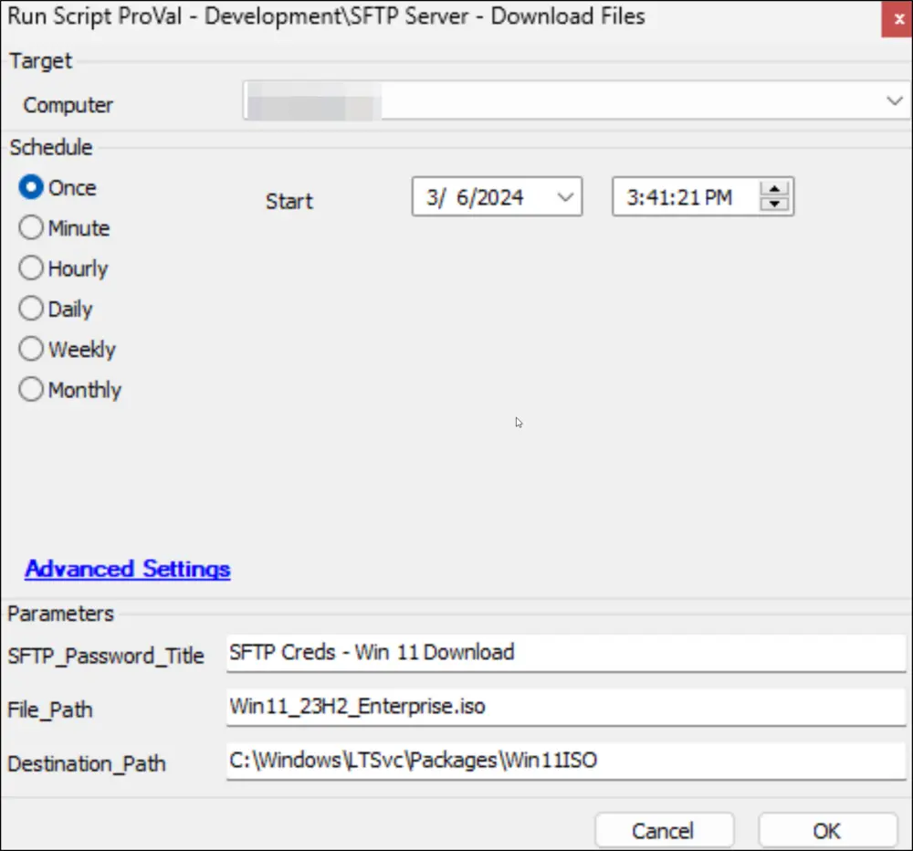

## Summary

The script facilitates an option to download a file from SFTP servers. The information for the download should be saved in a client-level password entry, as explained later in this document. The title of that password entry should be provided to the script through the user parameter `SFTP_Password_Title`.

## Password Entry

Setting the required details to execute the script into a client-level password entry is mandatory. The password entry should be configured as follows:

- **Title:** The title can be anything; however, it should be unique for the client and should not already exist in the client. The script will use this title to fetch the details from the password entry.

- **User Name:** The username required to access the SFTP server.

- **URL:** Store the hostname of the SFTP server in the URL field.

- **Password:** The password should belong to the user stored in the `User Name` field.  
  

## Sample Run

## Variables

| Name              | Description                                         |
|-------------------|-----------------------------------------------------|
| ProjectName       | Get-SFTPFile                                       |
| WorkingDirectory   | C:/ProgramData/_Automation/Script/Get-SFTPFile    |
| ScriptPath        | C:/ProgramData/_Automation/Script/Get-SFTPFile/Get-SFTPFile.ps1 |

## User Parameters

| Name                   | Example                           | Required | Description                                                                                                             |
|------------------------|-----------------------------------|----------|-------------------------------------------------------------------------------------------------------------------------|
| SFTP_Password_Title    | SFTP Creds - Win11 Download       | True     | Title of the password stored in the client's Password tab to download the required file from the SFTP server.         |
| File_Path              | Win11_23H2_Enterprise.iso         | True     | Full path to download from the SFTP server. If the file is placed at the root level in the SFTP server, then use the file's name as illustrated in the sample run. |
| Destination_Path       | C:/Windows/LTSvc/Packages/Win11ISO | False    | Full path of the directory on the end machine to store the downloaded file. By default, the script will download the file into `C:/temp` if this parameter is not set. |

## Output

- Script Logs