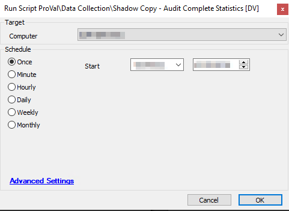

## Summary

This script records data related to Shadow Copy for individual systems into a [Custom Table - plugin_proval_shadowcopystats](/docs/59bbf54a-55af-42fa-9e77-cd0b105122de).

**Note:** Get the below MD5 file hash whitelisted for the script to work in the environment where ThreatLocker or any blocking application is installed.  
MD5 File Hash: `E69A5AD2CDCF7B20C7205D4A7BEC08C4`  

**Time Saved by Automation:** 5 Minutes

## Sample Run

## Dependencies

- [Dataview - Windows - Shadow Copy State [Script]](/docs/69110f54-d14f-4691-a68f-56bbc88b5fb3)  
- [Custom Table - plugin_proval_shadowcopystats](/docs/59bbf54a-55af-42fa-9e77-cd0b105122de)

## System Property

| Name                              | Example | Required | Default | Description                                                                                                                                                                   |
|-----------------------------------|---------|----------|---------|-------------------------------------------------------------------------------------------------------------------------------------------------------------------------------|
| Proval_ShadowCopyMaxAgeInDays     | 10      | True     | 10      | This property is required so that the [Monitor - Missing Recent ShadowCopy [Autofix]](/docs/ef826863-c354-4a97-9ba8-8ad2a3c65e40) can trigger this script to run as autofix to collect the latest data. |

## Process

This script will first verify that the target system is a Windows-based device; if not, it will exit the script.

The script will verify that the [Custom Table - plugin_proval_shadowcopystats](/docs/59bbf54a-55af-42fa-9e77-cd0b105122de) has been created. If it does not exist in the database, it will create it.

The script will then ensure that the data for the target machine is removed so it can be updated.

The script will execute the PowerShell script, which will gather all the necessary data/stats about Shadow Copy on this system. The PowerShell script will also generate the "INSERT INTO" statement used to insert the data into the custom table. If the PowerShell script returns "No Shadow Copy Found," it will exit the script without modifying the custom table.

Finally, the script will run the SQL statement against the Automate server to insert the data into the database.

## Output

- Script logs.
- Custom table [Custom Table - plugin_proval_shadowcopystats](/docs/59bbf54a-55af-42fa-9e77-cd0b105122de).
- Dataview [Dataview - Windows - Shadow Copy State [Script]](/docs/69110f54-d14f-4691-a68f-56bbc88b5fb3).

