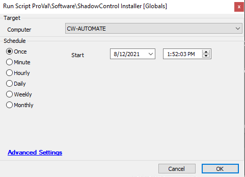

## Summary

This script downloads and installs the ShadowControl client on the target machine and subscribes it to the appropriate SC server.

**Time Saved by Automation:** 10 Minutes

## Sample Run

#### Global Parameters

| Name                  | Example                                             | Required | Description                                               |
|-----------------------|-----------------------------------------------------|----------|-----------------------------------------------------------|
| FQDNServerAddress     | [storagecraft.provaltech.com](http://storagecraft.provaltech.com) | True     | Required to subscribe the agent to the ShadowControl portal. |

## Process

- Downloads and installs the ShadowControl client on the target machine.
- Automatically subscribes the installed client to the relevant ShadowControl server based on the global value.
- Deletes the downloaded installer upon completion.

## Output

**Script Log**

