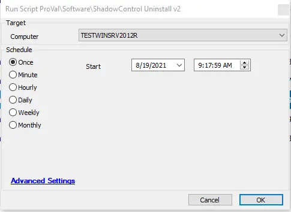

## Summary

This script will fetch the uninstall string from the database and attempt to uninstall ShadowControl and unregister it from the server.

**Time Saved by Automation:** # Minutes

## Sample Run

## Variables

- `@UninstallPath@` - Shows the uninstall path fetched from the database.
- `@NewUninstallPath@` - Shows the new uninstall path after using the replace function.

## Process

- Runs a shell command to unregister the agent from the server.
- Fetches the uninstall path from the database.
- Uses the replace function to create the new uninstall path.
- Utilizes that path for uninstalling the agent.

## Output

- Script log