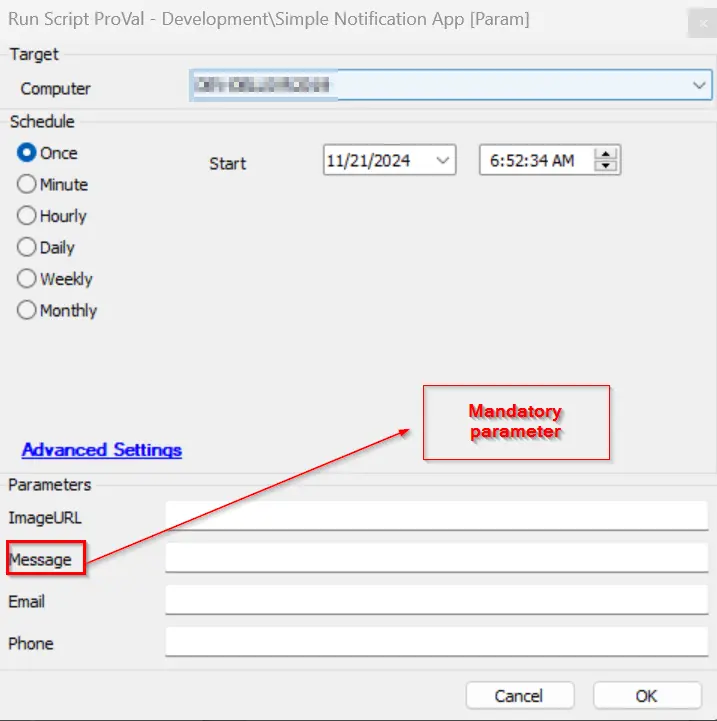
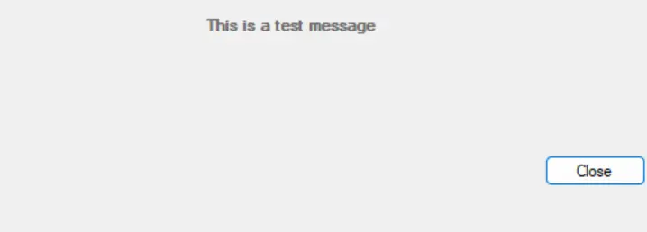
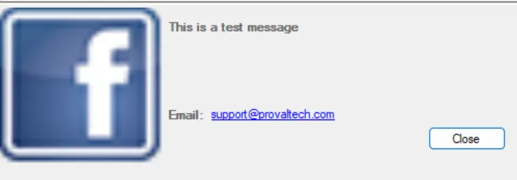

## Summary

This script is designed to deliver a one-time, customized message to the partner, featuring your company's branding through an optional image URL. For branding purposes, using a PNG or JPEG image URL is recommended, though not mandatory. Once executed, the script will display the message on the logged-in user's screen within one minute.

## Sample Run



The message parameter is mandatory to display the message to the user. All other parameters are optional; however, if no image is specified, it will result in a blank popup with only the message, which may cause trust issues with users.

## Requirements

- Windows Operating System
- .NET 4.5

## User Parameters

| Name      | Example                                                                                          | Required | Description                               |
|-----------|--------------------------------------------------------------------------------------------------|----------|-------------------------------------------|
| Message   | This is a test message                                                                          | True     | The message to be displayed to the end user. |
| ImageURL  | [http://p.favim.com/orig/2018/08/24/cute-beautiful-couple-avatar-Favim.com-6224738.jpg](http://p.favim.com/orig/2018/08/24/cute-beautiful-couple-avatar-Favim.com-6224738.jpg) | False    | The URL for the image to display instead of the default. |
| Email     | [someone@testing.com](mailto:someone@testing.com)                                               | False    | The support email address to be displayed to the user. |
| Phone     | 000-000-0000                                                                                   | False    | The support phone number to be displayed to the user. |

## Process

When executed, the application will open and display information based on the passed parameters. Parameters can be included or excluded based on needs. Clicking the *Close* button will exit the application. 

**Note:** The message parameter is mandatory to create a prompt using the application.

## Payload Usage

Example: Running the application with only the message parameter, which is mandatory to be specified:

```
C:/Windows/System32> C:/users/user/Desktop/SimpleNotification.exe
```



Example: Running the application with all parameters specified, mixing full names and aliases:

```
C:/Windows/System32> C:/users/user/Desktop/SimpleNotification.exe -m "This is a test message." --ImageURL "http://p.favim.com/orig/2018/08/24/cute-beautiful-couple-avatar-Favim.com-6224738.jpg" -e "someone@testing.com" --Phone "000-000-0000"
```


Example: Running the application with only some parameters specified:

```
C:/Windows/System32> C:/users/user/Desktop/SimpleNotification.exe -m "This is a test message." --i "https://proval.com/images/uploads/site-assets/facebook-icon.png" -e "support@provaltech.com"
```



| Parameter      | Alias | Required | Type   | Description                               |
|----------------|-------|----------|--------|-------------------------------------------|
| `--Message`    | `-m`  | True     | String | The message to be displayed to the end user. |
| `--ImageURL`   | `-i`  | False    | String | The URL for the image to display instead of the default. |
| `--Email`      | `-e`  | False    | String | The support email address to be displayed to the user. |
| `--Phone`      | `-p`  | False    | String | The support phone number to be displayed to the user. |

## File Hash

SHA256: A5B3122326170E0D6391C1DCF76C56DD9811A8EE0C3AA1A454E6FB19D427716E  
MD5: E6B792C00D46F2E867194CC79B13885D

## Output

- Script Log
