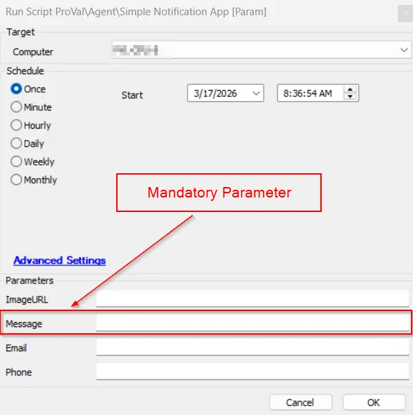

## Summary

This script is designed to deliver a one-time, customized message to the partner, featuring your company's branding through an optional image URL. For branding purposes, using a PNG or JPEG image URL is recommended, though not mandatory. Once executed, the script will display the message on the logged-in user's screen within one minute.

## Sample Run

The message parameter is mandatory to display the message to the user. All other parameters are optional; however, if no image is specified, it will result in a blank popup with only the message, which may cause trust issues with users.

## Dependencies

[SimpleNotification](/docs/df3d2cab-2568-4b41-b447-7b21ef64220b)

## Requirements

- Windows Operating System
- .NET 4.5

## Variables

| Name | Value |
| ---- | ----- |
| ProjectName | Run-SimpleNotification |
| AppName | SimpleNotification |
| WorkingDirectory | C:\ProgramData\_Automation\Script\Run-SimpleNotification |
| ScriptPath | C:\ProgramData\_Automation\Script\Run-SimpleNotification\Run-SimpleNotification.ps1 |
| AppPath | C:\ProgramData\_Automation\Script\Run-SimpleNotification\SimpleNotification.exe |
| ConfigFile | C:\ProgramData\_Automation\Script\Run-SimpleNotification\Config.toml |

## User Parameters

| Name      | Example                                                                                                       | Required | Description                                           |
|-----------|---------------------------------------------------------------------------------------------------------------|----------|-------------------------------------------------------|
| Message   | This is a test message                                                                                       | True     | The message is displayed to the end user. (Maximum 888 characters).  |
| ImageURL  | [http://p.favim.com/orig/2018/08/24/cute-beautiful-couple-avatar-Favim.com-6224738.jpg](http://p.favim.com/orig/2018/08/24/cute-beautiful-couple-avatar-Favim.com-6224738.jpg) | False    | The URL for the image to display instead of the default. |
| Email     | [someone@testing.com](mailto:someone@testing.com)                                                           | False    | The support e-mail address is displayed to the user. |
| Phone     | 000-000-0000                                                                                                 | False    | The support phone number is displayed to the user.   |

## Example

### Parameters

| Name | Value |
| ---- | ----- |
| ImageURL | `https://labtech.provaltech.com/labtech/transfer/images/alogo.jpg` |
| Message | `They said it's a secret mission, but I say it's a fashion emergency—Bond and I am armed with style and suspicious sunglasses!` |
| Email | `ram.kishor@provaltech.com` |
| Phone | `1234565432` |

### Notification

## Output

- Script Log
- Popup Message on User's desktop

## Changelog

### 2026-03-10

- Implemented dynamic UI resizing for the notification prompt based on the length of the incoming message.
- Added three responsive layout tiers: Small (less than equal to 300 characters), Medium (between 301-500 characters), and Large (greater than 500 characters).
- Established a maximum character limit of 888 characters for the Large layout; exceeding text will not be displayed.
- Preserved the base 500x150 layout in the visual designer, utilizing code-behind logic to handle all dynamic resizing at runtime.
- Signed the PS1 script

### 2025-04-10

- Initial version of the document
