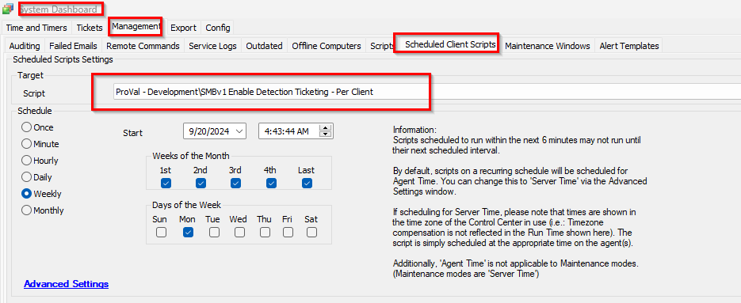

## Summary

This client script creates a ticket for each client with the computer count where remediation is required.

## Sample Run

## Dependencies

[CWA Script - SMBv1 Status Audit/Autofix [DV,Param]](/docs/4fd2cffe-c41b-4a3c-9b5e-3edb02ad322b)

## Variables

| Name                     | Description                                                                                                                                                           |
|--------------------------|-----------------------------------------------------------------------------------------------------------------------------------------------------------------------|
| @VulnerableagentCount@   | This stores the count of computers where remediation is required, marked by the script @Script: SMBv1 Enabled Detection & Remediation [DV,Param].              |
| TicID                    | This stores the ticket ID if any existing open ticket is detected, allowing comments to be made on the same ticket.                                            |

## Output

- Ticket

## Ticketing

1. Ticketing:
   
   **Subject**:  
   SMB1 Enable audit data detected on the client: @sqlname@  
   Here, @sqlname@ is the client's name.

   **Body**:  
   The SMBv1 Enable status audit was detected on the @VulnerableagentCount@ computer(s) of client "@sqlname@".  
   Please review the dataview for the computer list.

   OR

   The SMBv1 Enable status audit was detected on @VulnerableagentCount@ computer(s) of client "@sqlname@".  
   Please review the dataview for the computer list.

