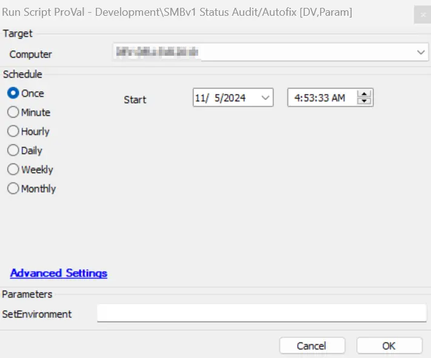
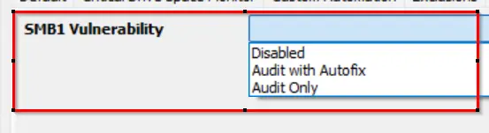
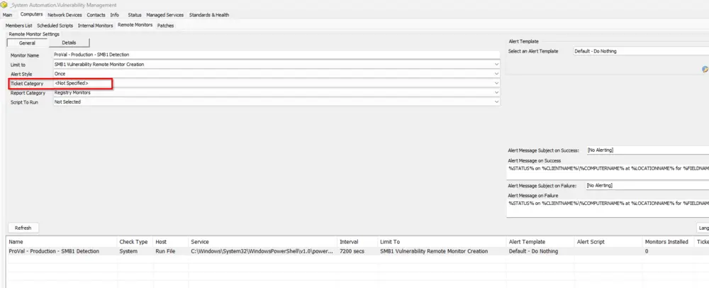

## Summary

This script is designed to run the detection and remediation for SMBv1 enabled based on EDF. It will act only if the dropdown EDF "SMB1 Vulnerability" is set to 'Audit Only' or 'Audit With Autofix' at any client, location, or computer level.

## Sample Run

It is required to execute this script after importing it with the setting `SetEnvironment = 1`.

## Dependencies

[Remote Monitor - SMB1 Detection](/docs/de67816f-e6ff-4fed-92e1-26fd5ae5359d)

## Variables

| Name                      | Description                                                                                                                                                                                                                      |
|---------------------------|----------------------------------------------------------------------------------------------------------------------------------------------------------------------------------------------------------------------------------|
| DetectionOnly             | This collects client-EDF 'CVE Vulnerability Detection Only' data for the agent where the script is deployed. If it is 1, then the SMBv1 enabled detection will run and register to the dataview without remediation.          |
| Detection-Remediation     | This collects data from client-EDF 'SMBv1 Enabled Detection and Remediation' for the agent where the script is deployed. If it is 1, then the SMBv1 enabled will be detected; if found enabled, then it attempts to disable it and logs the result to the dataview. |
| SMB1DisableOutput         | This contains the SMBv1-enabled remediation status of the agent.                                                                                                                                                              |
| RemediationStatusCheck     | This contains a report on whether the remediation was successful or not.                                                                                                                                                      |
| SMB1StateDetection        | This contains the SMBv1-enabled detection audit status of the agent.                                                                                                                                                          |
| TicketCreation            | This contains the ticket category ID applied on the [Remote Monitor - SMB1 Detection](/docs/de67816f-e6ff-4fed-92e1-26fd5ae5359d). If the category is set, then only the ticket will be created.                            |

### EDFs

| Name                                      | Level     | Type     | Example                   | Description                                                                                              |
|-------------------------------------------|-----------|----------|---------------------------|----------------------------------------------------------------------------------------------------------|
| SMBv1 Status                              | Computer  | Text     | Remediation Successful     | This stores the status of SMBv1 after script execution.                                                  |
| SMBv1 Logging                             | Computer  | Text     | @SMB1DisableOutput@       | This stores the script PowerShell execution output for logging.                                        |
| SMBv1 Detection Date                      | Computer  | Text     | 2024-05-01 00:00:00      | This stores the date and time when the last SMBv1 status was detected via the script.                  |
| SMBv1 Vulnerability                        | Computer  | Text     | Not Vulnerable            | This shows whether the device is vulnerable or not based on the script output detection.                |
| SMB1 Vulnerability                         | Client    | Dropdown | Audit Only                | This is a drop-down EDF with available options as . If it is set to Audit, and location and computer levels are not set to Disabled, then the Audit action or autofix will be performed on the agents of the clients. |
| SMB1 Vulnerability                         | Location  | Dropdown | Disabled                  | This is a drop-down EDF with available options as . If it is set to Audit, and the computer level is not set to Disabled while the client level EDF is not set to any Audit option, then the Audit action or autofix will be performed on the agents of the location. |
| SMB1 Vulnerability                         | Computer  | Dropdown | Disabled                  | This is a drop-down EDF with available options as . If it is set to Audit, and location and computer levels are not set to any Audit options, then the Audit action or autofix will be performed on the endpoint. |

## Output

- Script log
- Dataview

## Ticketing

1. **How to Enable Ticket:**
   - Navigate to the group 'Vulnerability Management' > Open group > Go to Computers > Remote Monitors.
   - Select the [Remote Monitor - SMB1 Detection](/docs/de67816f-e6ff-4fed-92e1-26fd5ae5359d) and check the ticket category .

   If this ticket category is set, then only the script will be able to create a ticket for the remediation step.

   **Failure:**
   - **Subject:**  
     SMB1 failed to disable on %ComputerName%
   - **Body:**  
     @TicketComment@  
     There are two possible failure comments:  
     The remediation PowerShell execution has failed. Refer to the logs below:  
     @SMB1DisableOutput@  
     OR  
     The remediation was attempted for the vulnerability fix on the computer %computername% but it failed. Refer to the logs:  
     @SMB1DisableOutput@  

   **Success:**
   - **Body:**  
     The vulnerability has been remediated successfully. Refer to the log information below:  
     @SMB1DisableOutput@