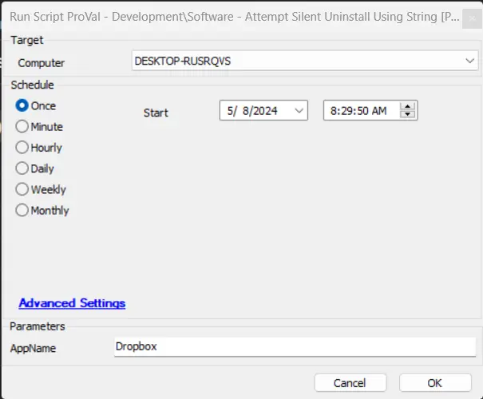

## Summary

This script fetches the uninstallation string from the database for the defined application specified in the parameter `@AppName@` and then attempts to uninstall the application. If `uninstall.exe` is found in the uninstallation string, it will attempt to uninstall the application using silent switches.

**Time Saved by Automation:** 10 Minutes

## Sample Run

### User Parameters

| Name     | Example  | Required | Description                                   |
|----------|----------|----------|-----------------------------------------------|
| AppName  | Dropbox  | True     | Application name that needs to be uninstalled |

## Process

When the script runs, it will prompt the user for the parameter `AppName`, which needs to be filled in. The script will then check if the software is installed on the machine. If it is, it will fetch the uninstallation string from the database for the specified application and attempt to uninstall it. If `uninstall.exe` is found in the uninstallation string, the script will use silent switches to uninstall the application. The script also verifies whether the software was successfully uninstalled and displays the result in the script's logs section.

## Output

- Script log